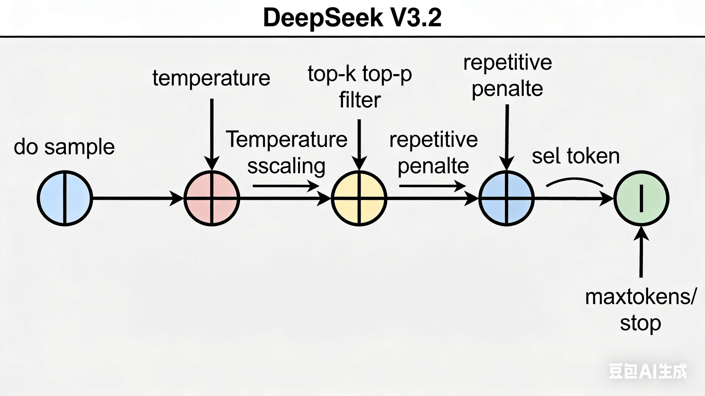
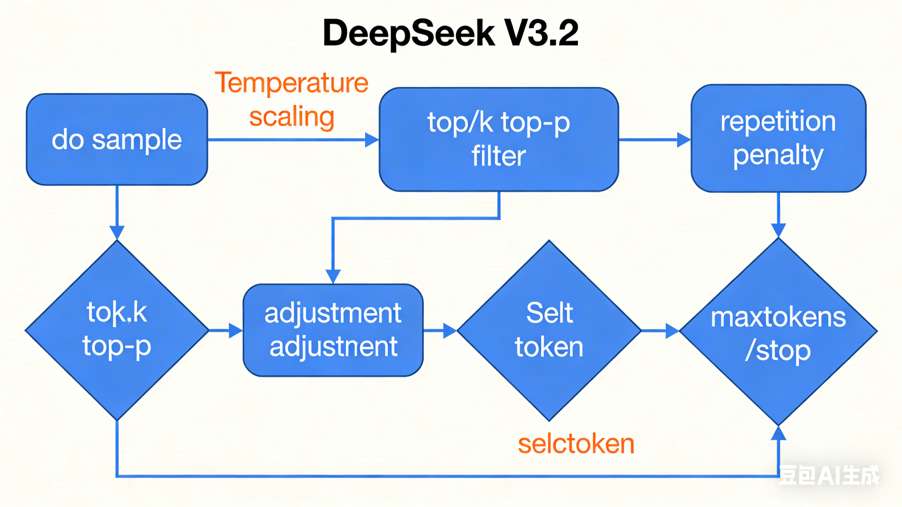
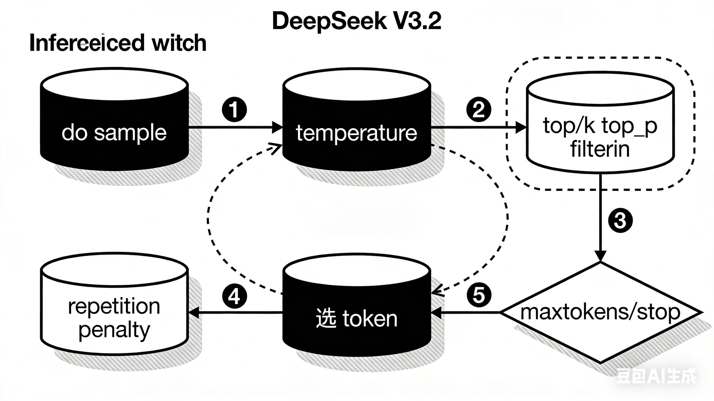
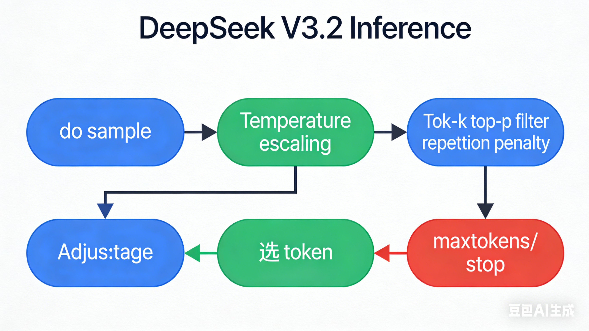

# [1904.09751] 神经文本退化的奇特案例 --- [1904.09751] The Curious Case of Neural Text Degeneration

> ## Excerpt
> Despite considerable advancements with deep neural language models, the enigma of neural text degeneration persists when these models are tested as text generators. The counter-intuitive empirical observation is that even though the use of likelihood as training objective leads to high quality models for a broad range of language understanding tasks, using likelihood as a decoding objective leads to text that is bland and strangely repetitive.
  In this paper, we reveal surprising distributional differences between human text and machine text. In addition, we find that decoding strategies alone can dramatically effect the quality of machine text, even when generated from exactly the same neural language model. Our findings motivate Nucleus Sampling, a simple but effective method to draw the best out of neural generation. By sampling text from the dynamic nucleus of the probability distribution, which allows for diversity while effectively truncating the less reliable tail of the distribution, the resulting text better demonstrates the quality of human text, yielding enhanced diversity without sacrificing fluency and coherence.

---
\[Submitted on 22 Apr 2019 ([v1](https://arxiv.org/abs/1904.09751v1)), last revised 14 Feb 2020 (this version, v2)\]  
\[提交于 2019 年 4 月 22 日（[v1](https://arxiv.org/abs/1904.09751v1)），最后修订于 2020 年 2 月 14 日（本版本，v2）\]

> Despite considerable advancements with deep neural language models, the enigma of neural text degeneration persists when these models are tested as text generators. The counter-intuitive empirical observation is that even though the use of likelihood as training objective leads to high quality models for a broad range of language understanding tasks, using likelihood as a decoding objective leads to text that is bland and strangely repetitive.  
> 尽管深度神经语言模型取得了显著进展，但当这些模型被测试为文本生成器时，神经文本退化的谜团依然存在。一个反直觉的实证观察是，尽管将似然作为训练目标能为广泛的语言理解任务创造出高质量模型，但将似然作为解码目标却导致文本平淡且异常重复。  
> In this paper, we reveal surprising distributional differences between human text and machine text. In addition, we find that decoding strategies alone can dramatically effect the quality of machine text, even when generated from exactly the same neural language model. Our findings motivate Nucleus Sampling, a simple but effective method to draw the best out of neural generation. By sampling text from the dynamic nucleus of the probability distribution, which allows for diversity while effectively truncating the less reliable tail of the distribution, the resulting text better demonstrates the quality of human text, yielding enhanced diversity without sacrificing fluency and coherence.  
> 本文揭示了人类文本与机器文本之间令人惊讶的分布差异。此外，我们发现仅靠解码策略就能显著影响机器文本的质量，即使生成于完全相同的神经语言模型。我们的发现推动了核采样，这是一种简单但有效的方法，旨在最大限度地发挥神经生成的价值。通过从概率分布的动态核心采样文本，这种核允许多样性且有效截断分布较不可靠的尾端，最终文本更好地展示了人类文本的质量，从而在不牺牲流畅性和连贯性的情况下提升多样性。

## Submission history  提交历史

From: Ari Holtzman \[[view email](https://arxiv.org/show-email/d7473f96/1904.09751)\]  
发件人：Ari Holtzman \[ [查看电子邮件](https://arxiv.org/show-email/d7473f96/1904.09751) \]  
**[\[v1\]](https://arxiv.org/abs/1904.09751v1)** Mon, 22 Apr 2019 07:17:18 UTC (749 KB)  
**[\[v1\]](https://arxiv.org/abs/1904.09751v1)** 2019 年 4 月 22 日 星期一 07：17：18 UTC（749 KB）  
**\[v2\]** Fri, 14 Feb 2020 21:56:30 UTC (4,271 KB)  
**\[v2\]** 2020 年 2 月 14 日 星期五 21：56：30 UTC（4,271 KB）


# 《The Curious Case of Neural Text Degeneration》核心结论及公式梳理
该论文聚焦神经文本生成中的“退化问题”（如重复、无意义文本），通过分析人类文本与机器文本的分布差异，对比现有解码策略，并提出“核采样（Nucleus Sampling）”方法，为解决文本退化提供了关键思路。


## 一、核心结论
### 1. 神经文本退化的核心矛盾
- **似然最大化解码（如波束搜索）的缺陷**：尽管似然函数是语言模型训练的有效目标，但将其作为解码目标时，会生成**重复、平淡的文本**。  
  原因包括：（1）“重复反馈循环”——重复序列的概率随重复次数递增（如“我不知道”的概率会随重复趋近于1）；（2）机器文本分布与人类文本差异显著：人类文本的token概率波动大（有高概率常用词，也有低概率内容词），而似然最大化生成的文本概率分布异常平坦且偏高，缺乏自然语言的“波动性”。
- **全分布采样的缺陷**：直接从模型的完整概率分布中采样，虽能避免重复，但易从**低置信度的尾部分布**（概率接近0的token）中采样，导致文本不连贯（如无意义词汇破坏上下文逻辑）。


### 2. 现有解码策略的局限性
| 解码策略 | 原理 | 核心问题 |
|----------|------|----------|
| 贪婪解码（Greedy） | 每次选择概率最高的token | 极端重复，多样性为0 |
| 波束搜索（Beam Search） | 保留top-k个候选序列并迭代扩展 | 随波束大小增加，重复问题加剧；分布平坦，缺乏自然性 |
| 温度采样（Temperature Sampling） | 通过温度参数调整概率分布陡峭度 | 温度过低趋近贪婪解码（重复），温度过高易采样尾部（不连贯） |
| Top-k采样 | 仅从概率最高的k个token中采样 | k为固定值：若k过小，文本平淡；若k过大，仍可能采样尾部 |


### 3. 核采样（Nucleus Sampling/Top-p Sampling）的优势
- **核心思想**：不依赖固定k值，而是动态选择“概率核”——即最小的token子集，其累积概率之和≥预设阈值p（通常取0.9），仅从该子集采样。  
- **优势**：（1）规避尾部低置信token，保证流畅性；（2）动态调整候选token数量，平衡多样性与连贯性；（3）生成文本的分布最接近人类文本（如n-gram多样性、词汇覆盖率均优于其他策略）。


### 4. 关键发现
- 人类文本的“非最高概率性”是固有属性：根据格莱斯沟通准则（Grice's Maxims），人类会避免“显而易见的表述”，因此自然文本不会是模型预测的“最高概率序列”。
- 解码策略对生成质量的影响远超模型本身：相同语言模型（如GPT-2）在不同解码策略下，生成质量差异巨大，证明“解码方法”是解决文本退化的关键。


## 二、核心公式
### 1. 语言模型的概率分解（基础）
语言模型通过“左到右”分解计算序列概率，生成时逐token预测：  
$$P\left(x_{1: m+n}\right)=\prod_{i=1}^{m+n} P\left(x_{i} | x_{1} ... x_{i-1}\right) \tag{1}$$  
- 符号说明：$x_{1:m}$ 为输入上下文（m个token），$x_{m+1:m+n}$ 为生成的续文本（n个token），$P(x_i|x_{1:i-1})$ 为给定前序token时，第i个token的条件概率。


### 2. 似然最大化解码的目标函数
贪婪解码、波束搜索等策略的核心目标是寻找“条件概率最高的续序列”：  
$$x_{m+1: m+n}=\underset{x_{m+1: m+n}}{argmax} P\left(x_{m+1: m+n} | x_{1: m}\right) \tag{2}$$  
- 缺陷：无法全局最优（NP难问题），且易陷入局部高概率的重复序列。


### 3. 全分布采样的公式
采样策略通过从条件分布中随机抽取token生成文本：  
$$x_{i} \sim P(x | x_{1: i-1}) \tag{3}$$  
- 问题：直接采样会包含尾部低概率token，导致文本退化。


### 4. 温度采样（Temperature Sampling）
通过温度参数$t$调整概率分布的陡峭度，$t \in [0,+\infty)$：  
$$p\left(x=V_{l} | x_{1: i-1}\right)=\frac{exp \left(u_{l} / t\right)}{\sum_{l'} exp \left(u_{l'} / t\right)} \tag{4}$$  
- 符号说明：$u_l$ 为模型输出的logits（未归一化概率），$V_l$ 为词汇表中的第l个token；  
- 特性：$t \to 0$ 时趋近贪婪解码（高概率token概率趋近1），$t \to +\infty$ 时趋近均匀采样（所有token概率相等）。


### 5. Top-k采样的概率重归一化
先筛选概率最高的k个token构成子集$V^{(k)}$，再对该子集的概率重归一化后采样：  
$$P'\left(x | x_{1: i-1}\right)= \begin{cases} 
\frac{P\left(x | x_{1: i-1}\right)}{p'} & \text{if } x \in V^{(k)} \\
0 & \text{otherwise}
\end{cases} \tag{5}$$  
- 符号说明：$p' = \sum_{x \in V^{(k)}} P(x | x_{1:i-1})$，即子集$V^{(k)}$的累积概率。


### 6. 核采样（Nucleus Sampling）的定义
筛选“累积概率≥p”的最小token子集$V^{(p)}$，再重归一化采样（重归一化公式同式5），核心是子集$V^{(p)}$的定义：  
$$\sum_{x \in V^{(p)}} P\left(x | x_{1: i-1}\right) \geq p$$  
- 特性：p通常取0.9，此时子集$V^{(p)}$的累积概率稳定在0.9左右，动态适配不同上下文的概率分布。


# logit_bias、temperature、top_p、top_k与论文概念的对应关系
结合论文（含《The Curious Case of Neural Text Degeneration》及补充文献）内容，以下是各参数与论文核心概念的精准对应，同时补充参数定义、作用逻辑及文献依据：


## 一、核心参数与论文概念的对应表
| 参数名称 | 对应论文概念 | 核心定义（基于文献） | 关键文献来源 |
|----------|--------------|----------------------|--------------|
| **temperature** | 温度采样（Temperature Sampling） | 用于调整语言模型输出logits的概率分布“陡峭度”的超参数：<br>- 低温度（0.2-0.5）：压缩概率分布，高概率token更突出，提升生成精准度（如数学推理）；<br>- 高温度（1.0-1.5）：拉平概率分布，增强随机性（多样性），但可能降低连贯性；<br>- 公式参考：$p\left(x=V_{l} | x_{1: i-1}\right)=\frac{exp \left(u_{l} / t\right)}{\sum_{l'} exp \left(u_{l'} / t\right)}$（$u_l$为logits，$t$为temperature） | 1. 《The Curious Case of Neural Text Degeneration》（原论文）<br>2. 摘要1（arXiv：温度平衡多样性与连贯性）<br>3. 摘要2（CSDN：控制softmax分布形貌） |
| **top_k** | Top-k采样 | 解码时仅保留概率最高的$k$个token，对这$k$个token的概率重归一化后采样：<br>- $k=1$时等价于“贪婪解码”（每次选概率最高token）；<br>- $k$越大，候选token越多，多样性越高，但可能包含低概率错误token；<br>- 缺陷：$k$为固定值，无法适配不同上下文的概率分布（如简单句需小$k$，复杂句需大$k$） | 1. 《The Curious Case of Neural Text Degeneration》（原论文：对比现有策略）<br>2. 摘要1（arXiv：定义“从top-k个token采样并归一化”）<br>3. 摘要3（代码实现：top_k参数控制保留最高$k$个logits）<br>4. 摘要4（掘金：k值与多样性/安全性的权衡） |
| **top_p** | 核采样（Nucleus Sampling/Top-p采样） | 动态筛选“累积概率≥阈值$p$”的最小token子集（称为“概率核”），仅从该子集采样：<br>- 无需固定$k$，随上下文自适应调整候选token数量（如概率集中时子集小，概率分散时子集大）；<br>- 典型$p$值为0.9，既规避低概率尾部token（保证连贯），又保留足够多样性；<br>- 核心优势：生成分布更接近人类文本（原论文验证n-gram多样性、词汇覆盖率最优） | 1. 《The Curious Case of Neural Text Degeneration》（原论文：提出核采样）<br>2. 摘要1（arXiv：定义“累积概率超$p$的token子集”）<br>3. 摘要3（代码实现：top_p参数控制累积概率阈值，参考Holtzman et al.原论文） |
| **logit_bias** | （补充概念：未直接出现在原论文核心策略中，但为相关扩展） | 对语言模型输出的logits（未归一化概率）进行“偏置调整”的技术：<br>- 原理：在计算softmax前，对特定token的logits增加/减少一个固定值（如给“积极词汇”加偏置，提升其被采样概率；给“敏感词汇”减偏置，降低其出现概率）；<br>- 作用：用于“定向引导生成内容”（如强制生成特定风格、规避特定token），属于“解码阶段的概率干预手段”，而非原论文对比的“基础采样策略”（原论文聚焦temperature/top-k/top-p，未提及logit_bias） | 无直接对应文献（原论文及补充摘要未提及），为现代LLM解码的扩展参数（如OpenAI API、Hugging Face库中常见） |


## 二、关键补充说明
1. **参数关联性**：实际解码中常组合使用多个参数（如“temperature+top_p”）——先用temperature调整logits分布，再用top_p筛选概率核，平衡多样性与连贯性（如摘要3代码实现：同时支持top_k和top_p过滤）。  
2. **logit_bias的特殊性**：该参数未出现在你提供的任何文献中（原论文及补充摘要），其核心作用是“定向干预token概率”（而非基础采样），属于原论文策略的延伸应用（如控制生成内容的风格、合规性）。  
3. **原论文的核心对比逻辑**：原论文通过实验证明——**top_p（核采样）在“连贯性-多样性”权衡上优于temperature、top_k**，因为它动态适配上下文，避免了temperature的“过平/过陡”和top_k的“固定$k$值僵化”问题。

# 总结

Top-K、Top-p 和温度都是影响生成token方式的推理参数，它们都作用于大模型的输出概率分布。

-   **Top-K 和 Top-p 均为采样策略**。它们并非特定于 LLMs，甚至根本不特定于神经网络。它们只是从离散概率分布中采样的方法。
-   Top-K 将我们要考虑的特定token限制为一定数量（K）。
-   Top-p 将我们限制在特定的累积概率 ( p ) 内。

相比之下，温度的作用方式不同：

-   **温度不是一种采样策略**，而是网络最后一层的 Softmax 函数的一个参数。
-   温度影响概率分布的形状。
-   高温使 token 概率彼此接近，这使得输出更加随机、“有创意”。
-   低温通过放大概率差异，这使得输出更加确定。
-   

# 给我用图的地方来详细讲解，比如说是在哪一层，比如说在前向传播层，还是在那个损失计算的地方，这些参数分别是作用在哪里的？

要理解解码参数的**层级作用位置**，需先明确**大模型推理的核心流程**：
预训练模型的**前向传播**只负责输出每个位置token的概率分布（logits），而**所有解码参数都不参与前向传播和损失计算**，仅作用于**前向传播之后的 token 采样/生成阶段**。

下面结合推理流程分层图，拆解每个核心参数的作用位置：

### 大模型推理流程分层图
```
输入 Prompt → [ 词嵌入层 → 注意力层 → Feed-Forward层 ] → 输出 logits（token概率分布） → 【解码参数作用阶段】→ 选下一个token → 循环直到终止
              ────────────── 前向传播层（模型权重计算） ──────────────    ────────────── 采样决策层（无模型权重） ─────────────
```

### 各解码参数的具体作用层级
| 解码参数         | 作用层级（对应上图）| 具体作用时机 & 逻辑 |
|------------------|-----------------------------|------------------------------------------------------------------|
| `do_sample`      | 采样决策层 **最顶层开关** | 决定后续采样逻辑：<br>1. `False` → 直接选 logits 概率最高的 token（贪心搜索），`temperature`/`top_p` 失效<br>2. `True` → 启用采样策略，进入后续参数逻辑 |
| `temperature`    | 采样决策层 **第一步缩放** | 在 `do_sample=True` 后，**先对 logits 做温度缩放**：<br>logits = logits / T<br>T越小，高概率token的优势越明显，低概率token越难被选中 |
| `top_k`/`top_p`  | 采样决策层 **第二步过滤** | 温度缩放后，对 logits 对应的概率分布做过滤：<br>- `top_k`：只保留概率最高的 k 个 token，其余概率置0<br>- `top_p`：累积概率到 p 为止，只保留这个区间内的 token<br>（组合使用时，通常先 `top_k` 过滤，再 `top_p` 二次过滤） |
| `repetition_penalty`/`frequency_penalty` | 采样决策层 **第三步调整** | 过滤后，对候选token的概率做惩罚修正：<br>对已生成过的token降低其概率，避免重复，**不改变前向传播的logits本身** |
| `beam_size`      | 采样决策层 **独立分支** | 与普通采样互斥，不依赖 `do_sample`：<br>同时保留 `beam_size` 条概率最高的生成路径，每步选总概率最高的路径延伸，本质是**多路径贪心** |
| `max_tokens`/`stop`/`eos_token_id` | 采样决策层 **终止判断** | 生成每一个token后，实时检查终止条件：<br>1. 生成token数达到 `max_tokens` → 停<br>2. 生成 `stop` 序列/`eos_token_id` → 停<br>与前向传播和采样逻辑并行判断 |
| `seed`           | 采样决策层 **随机数初始化** | 生成开始前，固定随机数种子，确保相同输入+参数下，采样结果可复现，不影响模型计算 |

### 核心结论
1. **前向传播层/损失计算层：无解码参数**
   前向传播的作用是根据输入 token 计算下一个 token 的 logits，依赖的是模型的权重参数（如注意力矩阵、FFN 权重），和 `temperature`/`top_p` 等解码参数无关；
   损失计算只出现在**训练阶段**，解码参数是**推理阶段专属参数**，训练时完全不涉及。

2. **解码参数的作用顺序 = 推理时的执行顺序**
   `do_sample` 开关 → `temperature` 缩放 → `top_k`/`top_p` 过滤 → `repetition_penalty` 调整 → 选token → `max_tokens`/`stop` 终止判断 → 循环生成。

# 画一张**DeepSeek V3.2 推理时的解码参数执行流程图**，标注清楚每个参数的先后触发节点？
[text](https://www.doubao.com/chat/34319878048664578)




