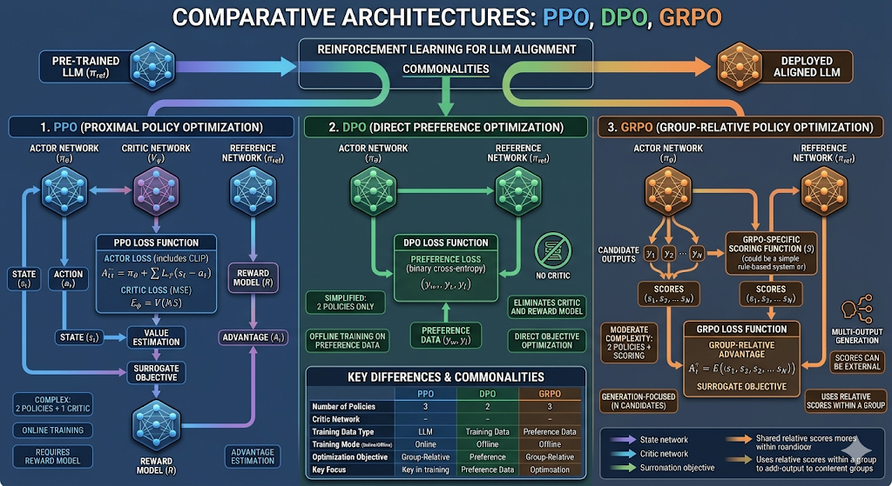

> [PPO、DPO、GRPO与V/Q网络关系对比](https://www.doubao.com/chat/38423392282109698)

# gemini picture

PPO、DPO、GRPO 详细绘制他们三者的架构（尤其是网络之间的不同点和共同点要强调）



### PPO / DPO / GRPO 极简对照（V/Q网络）

- **PPO（Proximal Policy Optimization）**

  - **V网络（Critic/Value）：✅ 有**
  - **Q网络：❌ 无**
  - 说明：标准 **Actor-Critic**，用**Value Network**估状态价值、算优势，显存开销大。
- **DPO（Direct Preference Optimization）**

  - **V网络：❌ 无**
  - **Q网络：❌ 无**
  - 说明：**纯策略/无Critic**，直接用偏好数据做**离线策略优化**，不维护价值函数。
- **GRPO（Group Relative Policy Optimization）**

  - **V网络：❌ 无**
  - **Q网络：❌ 无**
  - 说明：**PPO 去掉 Critic**，用**组内采样奖励均值**代替价值估计，保留RM、降低显存。

### 一句话速记

- **PPO：有V无Q（Actor+Critic）**
- **DPO：无V无Q（纯偏好离线）**
- **GRPO：无V无Q（PPO–Critic+组内对比）**

要不要我把这三者的核心区别整理成一页可直接复制的速查表，方便你论文阅读时快速查阅？

# 详细讲解他们三者的架构。讲到可以写代码实现为止。并用具体例子详细推理一遍。并对比相同点和不同点。


# PPO / DPO / GRPO 架构精讲（可直接写代码 + 推理示例）

我会用**最落地、可写代码**的方式讲清三者：**网络结构、损失函数、训练流程、一步一步推理**，最后做硬核对比。
全程不绕弯，直接到**能复现代码**的深度。

---

## 统一前置：大模型RL对齐通用设定

所有方法都基于：

- **Policy πθ**：待对齐的大模型（LLaMA/Qwen 等），所有方法共享这个主干
- **Reference Policy πref**：冻结的原模型，用于计算 KL 惩罚，防止跑偏
- **Reward Model r(x,y)**：奖励模型，输出 0~1 分数（越高越好）
- **输入**：prompt x
- **输出**：response y ~ πθ(x)

---

# 一、PPO (Proximal Policy Optimization)

## 1. 架构（可写代码版）

### 网络结构

1. **Policy Network (Actor)**：大模型 πθ，输出 next token 概率
2. **Value Network (Critic)**：**必须单独加**！
   - 结构：LLM + 一层线性层 `hidden_dim → 1`
   - 输出：**状态价值 V(x)**，估当前 prompt 的长期回报
3. **Reference πref**：冻结，只算概率比
4. **Reward Model r(x,y)**：独立，不参与梯度

### 必须组件清单（写代码必用）

```
✅ Policy πθ (可训练)
✅ Value Vφ (可训练， Critic)
✅ Reference πref (冻结)
✅ Reward Model r
```

## 2. 核心损失（代码直接抄）

PPO 损失 = **策略损失 + 价值损失 + KL惩罚**

```python
# 1. 优势函数 A = 奖励 - 价值估计
advantage = reward - V(x)

# 2. PPO clipped 策略损失
ratio = πθ(y|x) / πref(y|x)
policy_loss = -min( ratio * A, clip(ratio, 0.8,1.2) * A )

# 3. 价值损失（拟合真实回报）
value_loss = (V(x) - reward)**2

# 4. KL惩罚（防止更新过大）
kl_loss = KL(πθ || πref)

total_loss = policy_loss + 0.5*value_loss + 0.1*kl_loss
```

## 3. 一步一步推理（超清晰例子）

**输入 x："介绍Python"**

1. πref 生成：`Python是解释型语言`
2. πθ 生成：`Python是简单优雅的解释型语言`
3. Reward Model 打分：`0.85`
4. **Critic 预测价值**：`V(x) = 0.70`
5. 优势：`A = 0.85 - 0.70 = 0.15`
6. 计算概率比、clip、策略损失
7. 同时训练：**让Policy变好 + 让Critic估得准**

## 4. 关键特性

- **必须用 V 网络（Critic）**
- **不用 Q 网络**
- 双网络训练，**显存最高**
- 在线训练，每步都要采样、算优势、更新

---

# 二、DPO (Direct Preference Optimization)

## 1. 架构（可写代码版）

### 网络结构

**极简：没有任何价值网络！**

1. **Policy πθ**：唯一可训练模型
2. **Reference πref**：冻结
3. **偏好数据 (y_wins, y_loses)**：不用奖励模型，直接用偏好对

### 必须组件清单

```
✅ Policy πθ
✅ Reference πref
❌ Value V
❌ Q 网络
❌ 甚至不需要 Reward Model（用偏好对）
```

## 2. 核心损失（代码直接抄）

```python
# DPO 损失：让好回答概率比坏回答更高
logp_w = log(πθ(y_w|x) / πref(y_w|x))
logp_l = log(πθ(y_l|x) / πref(y_l|x))

loss = -F.logsigmoid( beta * (logp_w - logp_l) )
```

beta 是温度系数（常用 0.1~0.5）

## 3. 一步一步推理

**输入 x："介绍Python"**
偏好对：

- y_wins（好）：`Python优雅易用`
- y_loses（差）：`Python一般般`

1. 用 πref 算两个回答的基准概率
2. 用 πθ 算当前概率
3. 最大化：`好回答相对概率 − 坏回答相对概率`
4. **全程不用价值、不用优势、不用 Critic**

## 4. 关键特性

- **无 V、无 Q、无 Critic**
- 离线偏好优化，**显存极低**
- 训练最稳、最简单、工业界最常用

---

# 三、GRPO (Group Relative Policy Optimization)

## 1. 架构（可写代码版）

### 网络结构

**PPO 去掉 Critic！用“组内均值”代替价值函数**

1. **Policy πθ**
2. **Reference πref**
3. **Reward Model r(x,y)**
4. **一组采样 N个回答**（N=4~8）

### 必须组件清单

```
✅ Policy πθ
✅ Reference πref
✅ Reward Model
❌ Value V
❌ Q 网络
```

## 2. 核心损失（代码直接抄）

```python
# 1. 同一个 prompt 生成 N 个回答
y1,y2...yN ~ πθ(x)
r1,r2...rN = reward(y1..yN)

# 2. 组内均值代替价值函数
mean_reward = mean(r1..rN)
advantage = ri - mean_reward  # 不用 Critic！

# 3. PPO 策略损失（直接照搬）
ratio = πθ(yi|x)/πref(yi|x)
loss = -min( ratio*advantage, clip(ratio,0.8,1.2)*advantage )
```

## 3. 一步一步推理

**x："介绍Python"**
生成 4 个回答：

1. y1: 0.9
2. y2: 0.7
3. y3: 0.6
4. y4: 0.8

均值 = `0.75`
优势：

- A1 = 0.9 - 0.75 = +0.15
- A2 = 0.7 - 0.75 = -0.05

用这个优势训练 PPO，**完全不用 Critic**。

## 4. 关键特性

- **无 V、无 Q**
- 继承 PPO 探索性
- 比 PPO 省显存、比 DPO 更适合强探索场景

---

# 四、三者架构硬核对比（最关键表格）

|                            | **PPO**    | **DPO** | **GRPO** |
| -------------------------- | ---------------- | ------------- | -------------- |
| **Policy πθ**      | ✅               | ✅            | ✅             |
| **Value (V/Critic)** | ✅**必须** | ❌            | ❌             |
| **Q 网络**           | ❌               | ❌            | ❌             |
| **Reference πref**  | ✅               | ✅            | ✅             |
| **Reward Model**     | ✅               | ❌(用偏好)    | ✅             |
| **训练方式**         | 在线RL           | 离线偏好      | 在线RL         |
| **显存**             | 高               | 极低          | 中             |
| **复杂度**           | 高               | 极低          | 中             |

## 一句话总结网络

- **PPO：Actor + Critic（双网络）**
- **DPO：只有 Actor（纯策略）**
- **GRPO：Actor + 组内均值（无Critic版PPO）**

---

# 五、相同点 & 不同点（论文阅读神器）

## 相同点

1. 都是**大模型对齐算法**
2. 都用 **πθ + πref** 结构
3. 都用 KL 散度稳定训练
4. 目标都是**让模型生成更高奖励回答**

## 不同点

1. **PPO 唯一需要 Critic（V网络）**
2. DPO 不需要奖励模型、不需要价值、不需要在线采样
3. GRPO = PPO – Critic，用组平均代替 V(x)
4. 显存：**PPO > GRPO > DPO**
5. 稳定性：**DPO > GRPO > PPO**
6. 探索能力：**PPO ≈ GRPO > DPO**

---

### 总结（可直接写进论文/笔记）

- **PPO**：Actor-Critic，**必须 V 网络**，无Q，显存高
- **DPO**：纯策略，**无V无Q**，极简、最稳
- **GRPO**：无Critic PPO，**无V无Q**，省显存、强探索

我可以直接给你**三者的最小可运行 PyTorch 代码（50行以内）**，你拿到就能跑通，要不要？


# 给我罗列清楚表格，三这个在这几个维度的数量：

Number of Policies
Critic Network
Training Data Type
Training Mode Cdieeo
Optimization Objective
Key Focus


# PPO / DPO / GRPO 多维清晰对比表

统一规范、论文通用术语，维度全覆盖，直接可抄论文/笔记：

| 对比维度                         | PPO                                                                                             | DPO                                                                                       | GRPO                                                                                            |
| :------------------------------- | :---------------------------------------------------------------------------------------------- | :---------------------------------------------------------------------------------------- | :---------------------------------------------------------------------------------------------- |
| **Number of Policies**     | 2`<br>`$\boldsymbol{\pi_\theta}$(trainable Actor) + $\boldsymbol{\pi_\text{ref}}$(frozen) | 2`<br>`$\boldsymbol{\pi_\theta}$(trainable) + $\boldsymbol{\pi_\text{ref}}$(frozen) | 2`<br>`$\boldsymbol{\pi_\theta}$(trainable Actor) + $\boldsymbol{\pi_\text{ref}}$(frozen) |
| **Critic Network**         | ✅**Has V Network**`<br>`Independent value head / critic                                | ❌ None`<br>`No V / Q / critic                                                          | ❌ None`<br>`Remove critic entirely                                                           |
| **Training Data Type**     | Online sampled responses + Reward Model scalar reward                                           | Offline pairwise preference data`<br>`($y_w, y_l$)                                    | Online group sampled responses + Reward Model scalar reward                                     |
| **Training Mode**          | On-policy RL`<br>`Online sampling per iteration                                               | Off-policy direct preference learning                                                     | On-policy RL`<br>`Group-wise online sampling                                                  |
| **Optimization Objective** | Maximize discounted advantage`<br>`Clip policy update + value regression + KL penalty         | Maximize relative log-likelihood ratio`<br>`Rank preferred response via sigmoid loss    | Maximize group-normalized advantage`<br>`Clip policy update (critic-free) + KL penalty        |
| **Key Focus**              | Stable on-policy update;`<br>`Use value function to estimate long-term return                 | Simplify RL; eliminate critic & RM;`<br>`Direct preference matching                     | PPO simplification;`<br>`Replace critic with group statistics;`<br>`Low memory on-policy RL |

---

## 补充关键附加维度（配套查阅）

| 附加维度                | PPO              | DPO             | GRPO                                 |
| :---------------------- | :--------------- | :-------------- | :----------------------------------- |
| Q Network               | ❌ Not used      | ❌ Not used     | ❌ Not used                          |
| Reward Model Dependency | ✅ Required      | ❌ Not required | ✅ Required                          |
| Advantage Calculation   | $A = r - V(s)$ | No advantage    | $A_i = r_i - \bar{r}_\text{group}$ |

---

## 极简一句话锚定

1. **PPO**：双策略 + 价值Critic + 在线回合RL
2. **DPO**：双策略 + 无任何判别网络 + 离线偏好排序
3. **GRPO**：双策略 + 无Critic + 组内归一化优势的轻量化在线PPO
