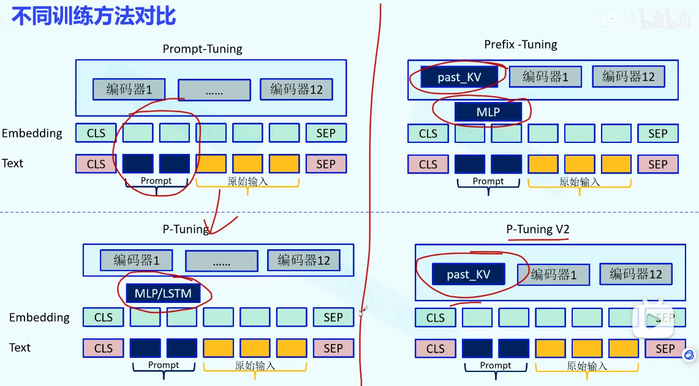
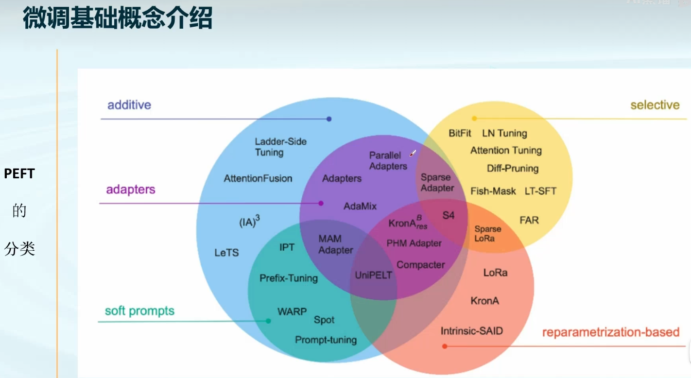

| 微调分类       | 概念描述                                                                 | 代表技术                     |
| -------------- | ------------------------------------------------------------------------ | ---------------------------- |
| 选择性微调     | 在微调过程中只更新模型部分参数，其他参数保持冻结，与加性方法相比无需改动模型架构 | Freeze、BitFit               |
| 加性微调       | 通过在模型中增加少量可训练模块/参数来适配任务，尽量减少需调节的参数量       | Prompt Tuning、Adapter       |
| 重参数化微调   | 通过将预训练权重进行低秩分解来微调，在训练时更新低秩表示，推理时合并回原模型以避免额外开销 | LoRA                         |

# 选择性微调策略Freeze
- 定义：“Freeze”（冻结微调）指在微调时冻结绝大部分预训练模型层，只微调极少数关键参数（通常是最后的输出层或顶层几层）。也即，仅允许少部分参数参与训练，其余大部分参数的梯度更新被关闭。这样模型利用预训练时学到的大量通用特征，仅通过调整少量参数来适应新任务。
- 优点：冻结大部分参数使需训练的参数量大幅减少，显著节省计算资源和显存占用。对数据或算力有限的场景，Freeze策略非常适用，能在低资源环境下快速微调模型。同时，大部分参数被固定，预训练模型的已有知识和表示能力得以保留，有助于避免对小数据微调时的过拟合，保持模型稳定性和泛化能力。整体而言，Freeze方法简单易行，实现成本低，在确保一定性能的前提下极大降低了微调开销。
- DiffPruning、FishMask、FAR 则引入了参数重要性评估机制，自动选择重要参数微调；此外只有 FAR 方法在训练阶段对模型作了局部重构以优化内存和计算。

# Prompt-Tuning
## 软提示和硬提示

| 特性       | 硬提示                 | 软提示                                   |
|------------|------------------------|------------------------------------------|
| 类型       | 离散文本，人工设计     | 连续向量，模型中可训练                   |
| 是否可训练 | ✖ 不能训练，需手工优化 | ☑ 可通过反向传播优化，适配任务           |
| 插入位置   | 通常仅限于输入层       | 可插入至输入层，也可深入每层Transformer（如Prefix） |
| 多任务支持 | ☑ 可支持（通过不同模板） | ☑ 强支持（通过不同向量区分任务）|
| 效果稳定性 | 依赖模板设计质量，训练波动大 | 表现稳定、训练更容易收敛                 |
| 参数效率   | 不增加模型参数         | 每个任务引入小量参数（几千~几万）|
| 自动化程度 | 低：需人工思考 prompt 设计 | 高：end-to-end 训练                      |

Prompt Tuning 和 Prefix Tuning 都是大语言模型微调的轻量级方法，核心区别体现在参数调整方式和结构设计上，二者均属于监督学习范畴，依赖标注数据进行训练。以下是具体分析：

### **1. 核心区别**
| **维度**         | **Prompt Tuning**                              | **Prefix Tuning**                              |
|------------------|------------------------------------------------|------------------------------------------------|
| **参数调整对象** | 在输入文本前添加可学习的“软提示词”（Soft Prompt），仅优化这些提示词参数，模型主体参数冻结。 | 在模型每一层的输入前添加可学习的“前缀向量”（Prefix Vectors），仅优化前缀参数，模型主体参数冻结。 |
| **结构设计**     | 软提示词仅作用于模型的输入层，后续层使用预训练模型的固定参数。 | 前缀向量贯穿模型所有层（如Transformer的每一层），每层都有独立的前缀参数，引导模型在各层逐步生成目标输出。 |
| **适用场景**     | 更适合自然语言理解（NLU）任务（如分类、情感分析），提示词可直接与输入文本结合引导分类。 | 更适合自然语言生成（NLG）任务（如文本生成、翻译），多层前缀能更好地控制生成过程的连贯性。 |
| **参数效率**     | 提示词长度通常较短（如10-100个token），参数规模更小（千级）。 | 前缀需覆盖所有层，参数规模相对更大（万级到十万级），但仍远小于全量微调。 |

### **2. 监督学习属性**
两者均基于**监督学习**：  
- 训练过程中需要带有标签的数据集（如分类任务的“文本+类别”，生成任务的“输入+目标输出”）。  
- 通过最小化模型预测结果与标签的损失（如交叉熵损失），优化可学习的提示词或前缀参数。  
- 本质是利用监督信号引导模型适配下游任务，无需无监督预训练阶段。

### **总结**
- **区别**：核心在于可学习参数的位置（输入层软提示 vs 全层前缀向量）和适用任务倾向（NLU vs NLG）。  
- **共性**：均为轻量级微调，仅优化少量参数，且依赖监督学习进行训练。

# Prompt Tuning vs Prefix Tuning vs P-Tuning vs P-Tuning v2

