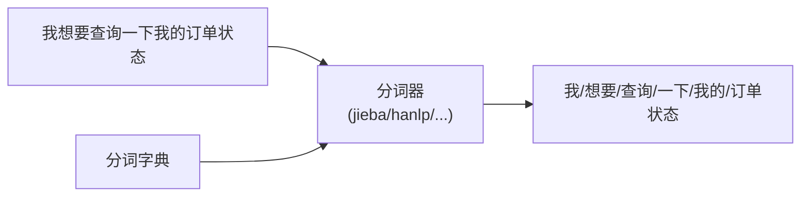
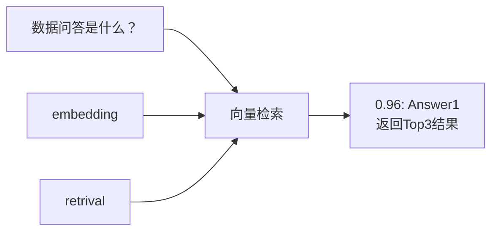
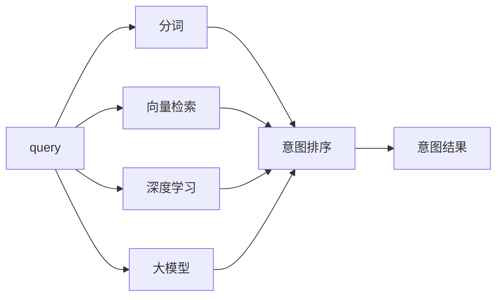

# https://www.xiaohongshu.com/explore/6901ec27000000000703a4e1?xsec_token=ABgKPa6YsWrTd_VljmWApFXuISqcvEnshinA5HlVBXRFI=&xsec_source=pc_collect


# 意图识别

## 1. 意图识别
**简介**：在任务型多轮对话中，意图识别是一个关键的环节。意图识别是指从用户输入的对话内容（如文本、语音等形式）中分析并判断出用户的目的或者意图。意图识别的具体作用如下：
- 有效引导对话流程：它能够帮助对话系统理解用户想要做什么，从而决定对话的走向。如果系统正确识别了用户是要查询订单状态，就可以引导用户提供订单相关的信息，如订单号等，以便完成查询任务。
- 提高对话效率：准确的意图识别可以避免系统对用户的回答驴唇不对马嘴。比如，当用户意图是退货，系统不会误解为换货而提供错误的引导步骤，从而让用户更快地得到想要的服务，减少对话的轮数。
- 增强用户体验：当系统能够精准理解用户意图，用户会感觉自己的需求被重视和理解。相反，如果意图识别错误，用户可能会因为反复操作或者得不到正确的服务而感到沮丧。

**参考**：任务型多轮对话（二）| 意图识别

### 意图识别示例
1. 例如，在一个智能客服对话系统中，用户输入“我想要查询一下我的订单状态”，系统通过意图识别就能判断出用户的意图是查询订单状态。

## 1.1. 意图识别难点
目前业界相对较小的模型，如果对话轮数过长，例如超过3轮，且每轮对话字数较多，模型回复易陷入混乱，回复质量降低。

**解决思路1**：一种粗暴的解决办法是删掉历史对话，仅保留最新的，但这样又会影响对话的流畅度。

**解决思路2**：基于上下文语义分割 + 基于上下文槽位关联

**解决思路3**：基于多路多轮数据的微调


## 2. 单轮意图
**简介**：单轮意图识别：是指仅针对用户的单句输入进行意图判断。例如，在一个问答系统中，用户问“今天的天气如何？”，系统只需要对这一个句子进行意图识别出用户是想查询天气信息的意图。它聚焦于独立的、一次性的用户表达，不考虑之前或之后可能的对话内容。

单轮意图识别相对简单，因为它只需要处理一个句子的语义理解。通常可以通过关键词匹配、简单的语法分析和基于单句的机器学习模型来实现。

### 单轮意图示例
1. 例如，通过查找句子中是否存在“天气”“查询”等关键词来判断意图，不需要考虑上下文对话的变化和逻辑连贯性。

下面我们来介绍5种常见的方案：基于规则、向量检索、深度学习、大模型、融合方案

### 1.基于规则的意图识别
基于规则的方案往往需要应用到分词器，例如jieba、hanlp等。通过分词后，会返回预先设置的关联短语或词汇（没命中返回空即可），然后返回意图。



### 2.向量召回意图识别
向量检索的目的是将输入query匹配到知识库里面与之相似的其他query。这里需要使用embedding（向量化）和retrieval（检索），向量化的模型很多，例如lgbge、simcse 和 promcse等；检索的工具也有很多，例如Faiss、Milvus 和 Hologres等。通过向量检索后，会返回top3相似query及相似度值。




### 3.深度学习意图识别
使用深度学习的方法来做意图识别是一种常见的方法，一般是文本分类深度学习框架，例如：预训练模型（RoBERTa、ALBERT等） + TextCNN。这里需要人工设定分类类别和标注数据，然后使用分类模型训练与推理部署。数据集构建如下：

| text               | label |
|--------------------|-------|
| XXXXXXXXXXXXXXX    | A001  |
| XXXXXXXXXXXXXXX    | A002  |
| XXXXXXXXXXXXXXX    | A003  |
| XXXXXXXXXXXXXXX    | A004  |
| XXXXXXXXXXXXXXX    | A005  |


### 4.大模型意图识别
使用大模型的方法来做意图识别是一种越来越流行的方法，这里分为2种，第一种不需要微调，直接使用prompt的形式给到大模型，然后大模型返回意图结果；另一种需要微调，意味着需要人工标注一定量的数据，然后给大模型做微调训练。

#### 1. Zero Shot/Few Shot
```python
query = "XXXXXXXXXX"
prompt = """你是一个NLP专家，请根据以下多个意图的描述，确保将[输入]映射到其中一个意图上。
意图类别有：A001 | A002 | A003 | A004 | A005。
各个意图的描述和关键词如下，其中【】为意图名称，()为关键词：
【A001】：XXXXXXXXXX，包含关键词(XXXXXXXXXX)；
【A002】：XXXXXXXXXX，包含关键词(XXXXXXXXXX)；
【A003】：XXXXXXXXXX，包含关键词(XXXXXXXXXX)；
【A004】：XXXXXXXXXX，包含关键词(XXXXXXXXXX)；
【A005】：XXXXXXXXXX，包含关键词(XXXXXXXXXX)；
注意，优先匹配关键词，最终输出上述意图列表中的一个意图， 不要输出推理过程。
示例如下：
【输入】：XXXXXXXXXX 【输出】：XXXXXXXXXX
【输入】：XXXXXXXXXX 【输出】：XXXXXXXXXX
【输入】：XXXXXXXXXX 【输出】：XXXXXXXXXX
【输入】：{(%s)}"""% (query)
```

#### 2. SFT
如果对准确率有非常高的要求，且有人工标注资源，这个时候使用大模型进行微调会是一个比较不错的选择。使用大模型微调需要注意以下几点：
a. 大模型选择；
b. 文本长度设置；
c. 标注数据的质量和数量。

**SFT数据如下**：
```python
sample = {
    "human": "你是一个NLP专家，请根据以下多个意图的描述，确保将[输入]映射到其中的一个意图上。\n意图类别有：A001 | A002 | A003 | A004 | A005。\n[输入]：xxxxxx。",
    "assistant": "A001"
}
print(sample["human"])
# 你是一个NLP专家，请根据以下多个意图的描述，确保将[输入]映射到其中的一个意图上。
# 意图类别有：A001 | A002 | A003 | A004 | A005。
# [输入]：xxxxxx。
```


### 5.融合方案
在实际项目中，意图识别往往并不能被单一模型完成，因为准确率、业务逻辑、上线效率等都是需要考虑的因素。所以，一个串并行同时存在且进行排序的意图框架往往是我们所需要的。



这里，我们注意2点：先后关系和意图排序，可以根据实际需求采取不同的策略。例如，通过关键词可以快速召回意图，可以放置在最前面；通过大模型配置prompt召回部分意图等。


## 3. 多轮意图
**简介**：多轮意图识别：涉及对用户在一系列对话轮次中的意图进行识别。多轮意图识别要复杂得多，它需要考虑对话的历史信息，包括之前轮次的意图、对话的主题转移、用户情绪的变化等诸多因素。多轮意图识别系统需要能够及时捕捉到这种意图的转变，并准确理解每个意图在整个对话流程中的作用。

多轮意图广泛应用于复杂的对话系统，如智能客服、智能聊天机器人等。在智能客服场景中，用户和客服之间的对话往往是多轮的，涉及产品咨询、故障报修、投诉处理等多种复杂的意图，需要多轮意图识别来提供精准的服务。在智能聊天机器人用于情感陪伴等场景时，也需要多轮意图识别来理解用户情绪的变化和聊天主题的转换，从而给出更合适的回应。

### 多轮意图示例
1. 比如在一个智能客服对话场景下，用户先问“我买的商品坏了怎么办？”，客服回答后，用户又问“那维修需要多长时间？”，多轮意图识别需要综合考虑这两轮对话，判断出用户最初是想了解商品损坏后的解决方案，后续是想知道维修时长，并且理解这两个意图之间的关联。


### 1.Pipeline
在pipeline的多轮对话中，仅仅使用当前query往往不一定能给出正确的意图，还需要查看历史的对话信息。

```mermaid
flowchart LR
A["我想定一张从武汉去北京机票。"] --> B["理解模块（NLU）"]
C["好的，请问您什么时候出发呢?"] <-- D["生成模块<br/>(NLG)"]
D <-- E["对话管理模块<br/>(DM)"]
E <-- F["Intent"]
G["Slot"] <-- F
B --> F
```

#### 如何判断上下文是否关联？
这里主要通过2种途径，第1种是基于上下文语义上的，第2种是上下文槽位信息的。

##### 1. 基于上下文语义分割
```python
# User: 前天武汉的天气?
# System: 前天武汉的天气是15-25度，xxxxxxx。
# User: 那北京的呢?
# System: 前天北京的天气是10-20度，xxxxxxx。
```
关于如何实现上下文语义分割，当前主要是基于深度学习或大模型方法。如果使用深度学习方法，可以基于NER算法框架来实现，从而来判断上下文衔接是否可分；如果使用大模型，需要标注一少部分数据，再微调大模型，从而判断上下文是否可分。


##### 2. 基于上下文槽位关联
如果将“那北京的呢？”改成“北京”，仅从语义上看，并不能判断User是否想问“前天北京的天气？”，但是通过槽位（地点）可以判断需要继承用户想问天气的意图。

```python
# (by草莓师姐)
# User: 前天武汉的天气?
# System: 前天武汉的天气是15-25度，xxxxxxx。
# User: 北京
# System: 前天北京的天气是10-20度，xxxxxxx。
```
如果仅通过槽位进行上下文关联时，有时候会出现错误，这也是过往基于槽位多轮意图的问题。


### 2.大模型End--2--End方案
```mermaid
flowchart LR
A["我想定一张从武汉去北京机票。"] --> B["大模型<br/>(微调)"]
C["好的，请问您什么时候出发呢?"] <-- B
```

#### 1. 指令数据集构建
在端到端的多轮意图中，构建指令数据集可能是工作量最大的一部分，不过好在大模型在多轮意图上的理解能力是可以随着指令数据集的扩展来进行迭代优化的，当然前提是大模型基座的能力是ok的。

下面，介绍一种多轮意图指令数据集构建的方法：
```python
# (by草莓师姐)
sample = {
    "human": "你是一个NLP专家，请根据历史对话信息，来判断当前对话[USER-current]的意图。\n意图类别有：A001 | A002 | A003 | A004 | A005。\n历史对话信息如下：\n# [USER]: xxxxxxx\n# [ROBOT]: xxxxxxx\n# [USER]: xxxxxxx\n# [ROBOT]: xxxxxxx\n当前对话下：\n# [USER-current]: xxxxxxx",
    "assistant": "A001"
}
print(sample["human"])
# 你是一个NLP专家，请根据历史对话信息，来判断当前对话[USER-current]的意图。
# 意图类别有：A001 | A002 | A003 | A004 | A005。
# 历史对话信息如下：
# [USER]: xxxxxxx
# [ROBOT]: xxxxxxx
# [USER]: xxxxxxx
# [ROBOT]: xxxxxxx
# 当前对话下：
# [USER-current]: xxxxxxx
```

如果没有历史对话信息，可以构建这样的指令数据：
```python
sample = {
    "human": "你是一个NLP专家，请根据上下文的对话信息，来判断当前对话[USER-current]的意图。\n意图类别有：A001 | A002 | A003 | A004 | A005。\n历史对话信息如下：无历史对话。\n当前对话下：\n# [USER-current]: xxxxxxx",
    "assistant": "A001"
}
print(sample["human"])
# 你是一个NLP专家，请根据上下文的对话信息，来判断当前对话[USER-current]的意图。
# 意图类别有：A001 | A002 | A003 | A004 | A005。
# 历史对话信息如下：无历史对话。
# 当前对话下：
# [USER-current]: xxxxxxx
```


### 3.多级意图
在实际项目中，往往存在多级意图。例如，用户说“帮我定一张武汉去北京的机票”，它可能有一级意图“出行”和二级意图“机票预定”。又比如，用户说“我想听音乐”，这是一个初步意图，可能接着会有“播放某歌手的歌曲”“切换到下一首”“调高音量”等后续的多级意图。


# 预训练模型（RoBERTa、ALBERT 等） + TextCNN 分别是干什么的？具体讲解一下？
要理解**预训练模型（RoBERTa、ALBERT 等）**和**TextCNN**在意图识别中的作用，我们可以分别拆解它们的功能，再说明两者结合的逻辑：


### 一、预训练模型（以 RoBERTa、ALBERT 为例）
预训练模型是**基于大规模无标注文本训练的通用语言理解模型**，核心作用是**将文本转化为富含语义信息的向量表示（词嵌入/句嵌入）**。

- **RoBERTa**：是 BERT 模型的优化版本，通过调整训练策略（如更大的批量、更多的训练数据、去掉下一句预测任务等），在多项 NLP 任务上取得了更优的性能。它能捕捉文本的**上下文语义、语法结构、词义消歧**等复杂信息，比如区分“银行（金融机构）”和“银行（河边）”的不同含义。
- **ALBERT**：是 BERT 的轻量版，通过“参数共享”和“句向量压缩”等技术，大幅减少了模型参数，同时保持了较强的语义理解能力，更适合资源有限的场景。


在意图识别中，预训练模型的作用是**把用户输入的文本（如“我要查订单状态”）转化为高维语义向量**，让计算机能“理解”文本的含义，为后续的分类任务提供优质的特征输入。


### 二、TextCNN
TextCNN 是**专门用于文本分类的卷积神经网络模型**，核心作用是**从文本的语义向量中提取关键特征，并完成分类任务**。

它的工作流程类似图像处理中的 CNN：
1. **卷积层**：用不同大小的卷积核（如 2-gram、3-gram）对文本向量进行卷积操作，捕捉文本中**局部的语义组合特征**（比如“查+订单”“退+货”这样的短语组合）。
2. **池化层**：对卷积结果进行最大池化（Max Pooling），筛选出每个卷积核下最具代表性的特征。
3. **全连接层+分类层**：将池化后的特征拼接，通过全连接层和 Softmax 函数输出不同意图类别的概率（如“查询订单”“申请退货”“咨询物流”等）。


在意图识别中，TextCNN 负责**基于预训练模型输出的语义向量，提取关键特征并完成“意图类别”的分类**，比如把“我要查订单状态”归类为“订单查询意图”。


### 三、两者结合的逻辑
在“预训练模型 + TextCNN”的框架中：
- 预训练模型负责**文本的“语义理解”**，将原始文本转化为包含丰富语义的向量；
- TextCNN 负责**基于这些向量的“特征提取与分类”**，最终输出用户的意图类别。

这种组合既利用了预训练模型对自然语言的通用理解能力，又通过 TextCNN 针对性地捕捉文本中与“意图”相关的局部特征，从而在意图识别任务中实现较好的准确率。

# GloVe、SBERT 分别是什么缩写？详细讲解用具体例子


### GloVe
- **缩写含义**：Global Vectors for Word Representation（全局词向量表示）。
- **功能讲解**：它是一种无监督的词嵌入方法，通过统计语料库中词的共现概率来学习词向量。核心思想是**用词的全局共现信息来捕捉词之间的语义和语法关系**。
- **具体例子**：比如在大量语料中，“国王”和“王后”经常与“男性”“女性”这类词共现，GloVe学习到的词向量会让“国王 - 男性 + 女性 ≈ 王后”这种语义关系在向量空间中成立；再如“汽车”和“轮胎”共现频率高，它们的词向量在空间中距离也会较近，能体现出“部分 - 整体”的语义关联。


### SBERT
- **缩写含义**：Sentence-BERT（句子级BERT）。
- **功能讲解**：是BERT模型的改进版，专门用于**句子级的语义表征**。它通过对BERT输出的词向量进行池化操作（如均值池化），将整个句子转化为一个固定长度的向量，从而实现句子级的语义相似度计算、文本聚类、意图识别等任务。
- **具体例子**：对于句子“我想查询订单状态”和“帮我查一下我的订单到哪了”，SBERT会为这两个句子生成语义相近的向量，通过计算向量间的余弦相似度，就能判断它们属于同一意图（订单查询）；再比如在文本聚类任务中，“今天天气很好，适合去公园散步”和“天气晴朗，推荐去郊外踏青”这两个句子的SBERT向量会被归为同一类，因为它们语义相似。

# 按照时间线，梳理所有的embedding模型
Embedding模型的发展历程涵盖了从早期的基础探索到如今的复杂高效模型阶段，以下是按照时间线对主要Embedding模型的梳理：
- **2003年**：Bengio等人提出了神经概率语言模型，这是现代词嵌入模型的雏形。该模型使用浅层前馈神经网络学习词语的分布式表示，通过词语共现信息捕捉词与词之间的语义关系，为后续Embedding模型的发展奠定了基础。
- **2008年**：Collobert和Weston提出了C&W模型，运用多任务学习的思想，把Embedding应用到命名实体识别、词性标注、语义角色标注等下游任务中，展现了词向量在NLP任务中的潜力。
- **2010年**：Turian等人提出了Word Representations模型，进一步改进了词向量的学习方法；同年，Mikolov等人提出了RNNLM，开创了用RNN做语言模型的先河。
- **2013年**：Mikolov团队发表了Word2Vec，成为Embedding技术发展的里程碑。该模型提出了CBOW和Skip - gram两种架构，并使用Negative Sampling、Hierarchical Softmax等优化训练技巧，能够学习到高质量的词向量，还能表达词语的语义关系，其开源实现推动了工业界对词嵌入技术的重视和应用。
- **2014年**：Pennington等人提出了GloVe模型，结合了全局词共现统计和局部上下文窗口，对稀有词和频繁词的建模更加平衡。
- **2017年**：Bojanowski等人提出了fastText模型，在Word2Vec的基础上引入了subword信息，对于形态丰富的语言建模更加有效，还能处理未登录词。
- **2018年**：Peters等人提出了ELMo模型，基于双向LSTM的词向量能根据上下文动态调整，抽取更加丰富的语义信息；同年，BERT模型诞生，通过双向Transformer架构，实现了上下文相关的动态Embedding，同一个词会根据所在句子的语境生成不同的向量，极大提升了语义理解精度。
- **2020年**：Microsoft发布了Turing - NLG，拥有170B参数量，在问答、文本摘要、机器翻译等任务上实现了显著的性能提升；OpenAI发布了GPT - 3，拥有1750亿参数，Few - shot性能惊人。
- **2022年**：Google Brain提出了UL2模型，采用Mixture - of - Denoisers的训练框架，在训练和推理中复合了不同corruption策略，在标准NLP benchmark以及一系列医疗、金融等垂直领域任务上刷新了纪录。


# [Word2Vec，成为 Embedding 技术发展的里程碑。该模型提出了 CBOW 和 Skip - gram 两种架构，并使用 Negative Sampling、Hierarchical Softmax 等优化训练技巧，能够学习到高质量的词向量，还能表达词语的语义关系，其开源实现推动了工业界对词嵌入技术的重视和应用。]其中每个单词分别是什么缩写？详细解释每个技术，并用具体的数据例子举例解释算法怎么计算的


### 一、核心缩写释义
| 术语                | 缩写全称                          | 中文释义                  |
|---------------------|-----------------------------------|---------------------------|
| CBOW                | Continuous Bag-of-Words           | 连续词袋模型              |
| Skip-gram           | Skip-gram Model                   | 跳字模型（也译“跳元模型”）|
| Negative Sampling   | 无缩写（直译）                    | 负采样（优化训练的技巧）  |
| Hierarchical Softmax | 无缩写（直译）                    | 层级Softmax（优化训练的技巧） |


### 二、各技术详细解释 + 数据例子 + 计算逻辑
#### 1. CBOW（Continuous Bag-of-Words）：用“上下文词”预测“中心词”
##### 核心思想
给定一个句子，取**中心词周围的上下文词**（比如左右各2个词）作为输入，训练模型预测中间的“中心词”，最终通过模型的权重学习得到每个词的向量。

##### 关键特点
- 输入是“多个上下文词的向量”，输出是“单个中心词的概率分布”；
- 训练速度快（一次输入多个词，预测一个词，适合高频词较多的语料）。

##### 具体数据例子
假设我们有句子：`[我, 今天, 想吃, 火锅, 配, 可乐]`  
- 设定“上下文窗口大小=2”（即中心词左右各2个词作为上下文）；
- 以“火锅”为**中心词**，则**上下文词**为：`[今天, 想吃, 配, 可乐]`；
- CBOW的任务：输入`[今天, 想吃, 配, 可乐]`的向量，预测输出“火锅”的概率最高。

##### 算法计算步骤（简化版）
1. **初始化词向量**：假设所有词的向量维度为`d=2`（实际中常用50/100/200维），随机初始化各词向量：
   - 今天：`[0.1, 0.3]`，想吃：`[0.2, 0.4]`，配：`[0.15, 0.35]`，可乐：`[0.25, 0.45]`，火锅：`[0.5, 0.7]`（目标中心词向量）；
2. **上下文向量平均**：将4个上下文词的向量做“均值池化”，得到上下文聚合向量：
   \[
   \text{上下文聚合向量} = \frac{[0.1+0.2+0.15+0.25, 0.3+0.4+0.35+0.45]}{4} = \frac{[0.7, 1.5]}{4} = [0.175, 0.375]
   \]
3. **线性变换 + 激活**：将聚合向量传入一个全连接层（权重矩阵`W`，维度`d×V`，`V`是词汇表大小），再通过Softmax激活，输出每个词作为“中心词”的概率：
   - 假设词汇表大小`V=1000`（包含“火锅”“米饭”“奶茶”等词），全连接层计算：`logits = 上下文聚合向量 × W`；
   - Softmax转换：`P(火锅|上下文) = exp(logits[火锅]) / Σ(exp(logits[所有词]))`；
4. **损失计算 + 向量更新**：用“交叉熵损失”衡量预测概率与真实标签（只有“火锅”为1，其他为0）的差距，通过反向传播更新词向量和权重`W`，让`P(火锅|上下文)`越来越接近1。

经过多轮训练后，“火锅”的向量会与“想吃”“配”等相关词的向量在空间中距离更近，捕捉到语义关联。


#### 2. Skip-gram（跳字模型）：用“中心词”预测“上下文词”
##### 核心思想
与CBOW相反：给定一个“中心词”，训练模型预测它周围的“上下文词”（比如左右各2个词），通过预测任务间接学习词向量。

##### 关键特点
- 输入是“单个中心词的向量”，输出是“多个上下文词的概率分布”；
- 对低频词更友好（比如“鱼子酱”这种低频词，作为中心词时能强制模型学习其与上下文的关联）。

##### 具体数据例子
还是用句子：`[我, 今天, 想吃, 火锅, 配, 可乐]`  
- 上下文窗口大小=2，以“火锅”为**中心词**，**上下文词**为：`[今天, 想吃, 配, 可乐]`；
- Skip-gram的任务：输入“火锅”的向量，预测输出`[今天, 想吃, 配, 可乐]`这4个词的概率均最高。

##### 算法计算步骤（简化版）
1. **初始化词向量**：同CBOW，“火锅”的初始向量为`[0.5, 0.7]`；
2. **中心词向量输入**：直接将“火锅”的向量`[0.5, 0.7]`传入全连接层（权重矩阵`W`，维度`d×V`）；
3. **多标签预测**：通过Softmax输出每个词作为“上下文词”的概率，此时目标是让`P(今天|火锅)、P(想吃|火锅)、P(配|火锅)、P(可乐|火锅)`均最大；
4. **损失计算 + 向量更新**：用“多标签交叉熵损失”（每个上下文词都是正例，其他词是负例），反向传播更新“火锅”的向量和权重`W`。

比如训练后，“火锅”的向量可能变成`[0.6, 0.8]`，而“可乐”的向量变成`[0.3, 0.5]`，两者在向量空间中的余弦相似度较高（语义相关）。


#### 3. Hierarchical Softmax（层级Softmax）：优化Softmax计算效率
##### 核心问题
原始Softmax的计算复杂度是`O(V)`（`V`是词汇表大小，比如10万、100万）：计算每个词的概率需要遍历所有词，训练速度极慢。

##### 核心思想
将“词汇表的分类任务”转化为“二叉树的路径查找任务”：
- 把每个词作为二叉树的叶子节点；
- 从根节点到叶子节点的路径，对应一系列二分类任务（左子树=0，右子树=1）；
- 计算某个词的概率，等价于计算路径上所有二分类的概率乘积，复杂度从`O(V)`降至`O(logV)`（二叉树的深度）。

##### 具体数据例子
假设词汇表`V=4`（包含“火锅”“米饭”“奶茶”“可乐”），构建二叉树：
- 根节点（R）→ 左子树（A）、右子树（B）；
- A→ 左（火锅）、右（米饭）；
- B→ 左（奶茶）、右（可乐）；
- 各词的路径：
  - 火锅：R→A→左（路径：0→0）；
  - 可乐：R→B→右（路径：1→1）。

##### 算法计算步骤（结合Skip-gram）
1. 输入中心词“火锅”的向量`[0.6, 0.8]`；
2. 根节点（R）的二分类：计算`P(左子树A|火锅)`（用Sigmoid激活，而非Softmax）：
   \[
   P(A|火锅) = \sigma(向量 \cdot W_R + b_R) = \frac{1}{1+e^{-(0.6×w_{R1}+0.8×w_{R2}+b_R)}}
   \]
   假设计算结果为`0.8`（倾向走左子树A）；
3. 节点A的二分类：计算`P(左子树|火锅)`：
   \[
   P(左|A, 火锅) = \sigma(向量 \cdot W_A + b_A) = 0.9
   \]
4. 路径概率乘积：“火锅”作为上下文词的概率 = `P(A|火锅) × P(左|A, 火锅) = 0.8×0.9=0.72`；
5. 损失计算：用二分类交叉熵衡量路径上每个节点的预测结果与真实路径的差距，反向传播更新向量。

通过这种方式，无需遍历所有4个词，只需计算2次二分类（`log2(4)=2`），效率大幅提升。


#### 4. Negative Sampling（负采样）：更高效的优化技巧
##### 核心思想
Hierarchical Softmax仍需计算路径上的所有二分类，而负采样进一步简化：
- 对于一个“正样本对”（中心词+上下文词，如“火锅-可乐”），随机采样`k`个“负样本对”（中心词+非上下文词，如“火锅-猫”“火锅-电脑”）；
- 训练目标：让正样本对的相似度尽可能高，负样本对的相似度尽可能低；
- 复杂度从`O(logV)`降至`O(k)`（`k`通常取5-20），训练速度比Hierarchical Softmax更快，是工业界更常用的方案。

##### 具体数据例子
基于Skip-gram的正样本对`(火锅, 可乐)`：
1. **正样本对**：`(火锅, 可乐)`（真实上下文关系，标签=1）；
2. **负样本采样**：从词汇表中随机选`k=2`个与“火锅”无上下文关联的词，组成负样本对：`(火锅, 猫)`（标签=0）、`(火锅, 电脑)`（标签=0）；
3. **相似度计算**：用“点积”衡量中心词向量与上下文词向量的相似度（点积越大，语义越近）：
   - 火锅向量`[0.6, 0.8]`，可乐向量`[0.3, 0.5]`：点积=0.6×0.3 + 0.8×0.5 = 0.18 + 0.4 = 0.58；
   - 火锅向量`[0.6, 0.8]`，猫向量`[0.1, 0.2]`：点积=0.6×0.1 + 0.8×0.2 = 0.06 + 0.16 = 0.22；
   - 火锅向量`[0.6, 0.8]`，电脑向量`[0.4, 0.1]`：点积=0.6×0.4 + 0.8×0.1 = 0.24 + 0.08 = 0.32；
4. **损失计算 + 向量更新**：用Sigmoid交叉熵损失，目标是：
   - 正样本点积`0.58`对应的`σ(0.58)`尽可能接近1；
   - 负样本点积`0.22、0.32`对应的`σ(0.22)、σ(0.32)`尽可能接近0；
   通过反向传播更新向量：比如“火锅”和“可乐”的向量会向“点积增大”的方向调整（比如火锅向量变成`[0.65, 0.85]`，可乐变成`[0.35, 0.55]`，点积变为0.65×0.35+0.85×0.55=0.2275+0.4675=0.69），而“火锅”与“猫”“电脑”的向量点积会进一步减小。


### 三、核心总结
| 技术                | 核心作用                          | 计算复杂度 | 适用场景                  |
|---------------------|-----------------------------------|------------|---------------------------|
| CBOW                | 上下文→中心词（预测）             | O(V)（原始）| 高频词多、语料量大的场景  |
| Skip-gram           | 中心词→上下文词（预测）           | O(V)（原始）| 低频词多、需精准语义的场景|
| Hierarchical Softmax | 优化Softmax计算效率               | O(logV)    | 词汇表极大（百万级）场景  |
| Negative Sampling   | 更高效的优化（正负压采样）        | O(k)（k=5-20）| 工业界主流，兼顾速度和效果|

通过这些技术，Word2Vec能高效学习到高质量的词向量，比如最终学到：
- 火锅向量`[0.7, 0.9]`，可乐向量`[0.4, 0.6]`，两者余弦相似度≈0.98（语义高度相关）；
- 火锅向量与猫向量`[0.1, 0.2]`的余弦相似度≈0.3（语义无关），完美体现了“语义关联”的捕捉能力。

# logits 一般是指什么意思？和logit和logistic的关系是什么？

要搞懂 `logits`、`logit`、`logistic` 三者的关系，核心是先明确各自的定义，再理清“术语演变”和“数学关联”，下面用通俗的语言+公式+实例拆解：


### 一、先明确三个术语的核心定义
#### 1. Logit（单数形式）：一个“对数几率”的数学概念
- **定义**：`logit` 是对“事件发生几率（Odds）”取自然对数的结果，本质是将“概率（0~1）”映射到“实数域（-∞~+∞）”的函数。
- **关键背景**：概率（Probability）是“事件发生的可能性”（如成功率50%），而**几率（Odds）** 是“发生概率 / 不发生概率”（如成功率50%时，Odds=0.5/(1-0.5)=1）。
- **数学公式**：  
  对于事件发生的概率 \( p \)（\( 0 < p < 1 \)），其 logit 为：  
  \[
  \text{logit}(p) = \ln\left( \frac{p}{1-p} \right)
  \]
- **例子**：  
  - 若 \( p=0.5 \)（50%概率），则 \( \text{logit}(0.5) = \ln(0.5/0.5) = \ln(1) = 0 \)；  
  - 若 \( p=0.8 \)（80%概率），则 \( \text{logit}(0.8) = \ln(0.8/0.2) = \ln(4) ≈ 1.386 \)；  
  - 若 \( p=0.1 \)（10%概率），则 \( \text{logit}(0.1) = \ln(0.1/0.9) ≈ \ln(0.111) ≈ -2.197 \)。  
  可见：`logit` 将 [0,1] 区间的概率，拉伸到了 (-∞,+∞) 的实数域。

#### 2. Logits（复数形式）：模型输出的“原始分数”
- **定义**：在机器学习（尤其是分类任务）中，`logits` 指模型最后一层全连接层的**原始输出**（未经过任何激活函数，如 Softmax、Sigmoid），其取值范围是 (-∞,+∞)。
- **为什么叫 logits？**：因为这些原始分数本质是“待转换为概率的对数几率雏形”——通过 Softmax/Sigmoid 激活函数，就能将 logits 映射为 [0,1] 区间的概率，这个过程是 `logit` 函数的“逆操作”。
- **例子**：  
  在之前 Word2Vec 的 CBOW 模型中，全连接层输出的 `logits = 上下文聚合向量 × W`（W 是权重矩阵），假设词汇表有3个词（火锅、米饭、奶茶），得到 logits 为 `[2.3, 0.7, -1.2]`：  
  - 这三个数值就是 `logits`（原始分数）；  
  - 经过 Softmax 激活后：\( \text{Prob}(火锅) = e^{2.3}/(e^{2.3}+e^{0.7}+e^{-1.2}) ≈ 0.85 \)，最终转化为概率。

#### 3. Logistic：与“逻辑回归”绑定的函数/模型名称
- **定义**：`logistic` 通常指 **Logistic 函数**（也叫 Sigmoid 函数），是一个“S形”的激活函数，核心作用是将 `logits`（-∞~+∞）映射为 [0,1] 区间的概率。
- **数学公式**：  
  \[
  \text{logistic}(x) = \sigma(x) = \frac{1}{1 + e^{-x}}
  \]
- **关键关联**：Logistic 函数是 `logit` 函数的**逆函数**——把 logit 输出的实数，还原为概率：  
  若 \( x = \text{logit}(p) = \ln(p/(1-p)) \)，则 \( p = \text{logistic}(x) = 1/(1+e^{-x}) \)。
- **例子**：  
  若 logit 为 1.386（对应 p=0.8），则 `logistic(1.386) = 1/(1+e^{-1.386}) ≈ 1/(1+0.25) = 0.8`，完美还原概率。


### 二、三者的核心关系（一张表理清）
| 术语       | 本质属性                | 取值范围       | 核心作用                                  | 关联逻辑                                  |
|------------|-------------------------|----------------|-------------------------------------------|-------------------------------------------|
| Logit      | 数学函数（对数几率）    | (-∞,+∞)        | 将概率 [0,1] 映射为实数域                 | 是 Logistic 函数的“正函数”                |
| Logits     | 模型原始输出（分数）    | (-∞,+∞)        | 作为激活函数的输入，待转换为概率          | 是 Logistic/Softmax 函数的输入             |
| Logistic   | 激活函数（Sigmoid）     | [0,1]          | 将 logits/Logit 映射为概率                | 是 Logit 函数的“逆函数”，是 logits 的“转换器” |

#### 通俗类比：
- Logit：像“把概率（苹果）榨成汁（实数）”的过程；  
- Logistic：像“把汁（实数）还原成苹果（概率）”的过程；  
- Logits：像“刚榨好的汁”（模型直接输出的原始产物），需要经过 Logistic/Softmax 这个“还原机”，才能变成可使用的“苹果（概率）”。


### 三、补充：与 Softmax 的关系（避免混淆）
你可能会问：分类任务中有时用 Softmax 而非 Logistic 函数，这和 logits 是什么关系？  
- 核心区别：Logistic 函数（Sigmoid）适用于**二分类**（输出单个概率），Softmax 适用于**多分类**（输出多个概率，总和为1）；  
- 共性：两者的输入都是 `logits`，输出都是概率；且 Softmax 本质是 Logistic 函数在多分类场景的扩展，都遵循“将实数域 logits 映射到 [0,1] 概率”的核心逻辑。

例子：  
- 二分类（是否是“火锅”）：logits = 2.3 → Logistic(2.3) ≈ 0.9（概率）；  
- 多分类（火锅/米饭/奶茶）：logits = [2.3, 0.7, -1.2] → Softmax 输出 [0.85, 0.14, 0.01]（概率总和1）。


### 四、总结
1. **Logit**：数学概念，是“概率的对数几率”，负责 [0,1]→(-∞,+∞) 映射；  
2. **Logits**：工程术语，是模型输出的原始分数（未激活），取值范围和 Logit 一致，等待被转换为概率；  
3. **Logistic**：激活函数（Sigmoid），负责 (-∞,+∞)→[0,1] 映射，是 Logit 的逆函数，也是 logits 转概率的核心工具；  
4. 一句话串联：模型输出 `logits`（原始分数）→ 经过 `Logistic` 或 Softmax 激活 → 转化为概率 → 概率可通过 `Logit` 函数反向映射为实数。

# 多标签交叉熵损失 具体计算公式和具体数据例子举例计算
# 多标签交叉熵损失（Multi-Label Cross-Entropy Loss）：公式+实例计算
多标签交叉熵损失是用于 **多标签分类任务** 的损失函数（区别于“多分类任务”：每个样本可同时属于多个类别，而非仅一个）。核心逻辑是：对每个类别独立计算二分类交叉熵，再求所有类别的平均损失。


## 一、核心前提（多标签任务特点）
- 每个样本的标签是 **one-hot编码的向量**（长度=类别数），其中：
  - `1` 表示样本属于该类别（正例）；
  - `0` 表示样本不属于该类别（负例）；
- 模型输出需通过 **Sigmoid激活函数**（而非Softmax），将每个类别的logits映射到 [0,1] 区间（每个类别独立预测概率，无需满足概率和为1）。


## 二、具体计算公式
### 1. 单样本损失公式
设样本有 \( C \) 个类别，：
- \( y_i \)：第 \( i \) 类的真实标签（0或1）；
- \( \hat{y}_i \)：模型预测第 \( i \) 类的概率（Sigmoid激活后，\( 0 < \hat{y}_i < 1 \)）；
- 单样本的多标签交叉熵损失为：  
  \[
  \text{Loss}_{\text{single}} = -\frac{1}{C} \sum_{i=1}^C \left[ y_i \cdot \ln(\hat{y}_i) + (1 - y_i) \cdot \ln(1 - \hat{y}_i) \right]
  \]
  - 公式解读：对每个类别，用“二分类交叉熵”计算损失（正例惩罚 \( \ln(\hat{y}_i) \)，负例惩罚 \( \ln(1 - \hat{y}_i) \)），再对所有类别取平均（除以 \( C \) 是为了让损失值范围更稳定，可选）。

### 2. 批量样本损失公式
设批量中有 \( N \) 个样本，总损失为所有样本损失的平均值：  
\[
\text{Loss}_{\text{batch}} = -\frac{1}{N \cdot C} \sum_{j=1}^N \sum_{i=1}^C \left[ y_{j,i} \cdot \ln(\hat{y}_{j,i}) + (1 - y_{j,i}) \cdot \ln(1 - \hat{y}_{j,i}) \right]
\]


## 三、具体数据例子（手把手计算）
### 场景设定
假设我们有一个 **“商品意图识别”的多标签任务**：
- 类别数 \( C=3 \)（类别1：查询订单，类别2：申请退货，类别3：咨询物流）；
- 单个样本的真实标签（one-hot）：\( y = [1, 0, 1] \)（表示该样本同时属于“查询订单”和“咨询物流”，不属于“申请退货”）；
- 模型输出logits（全连接层原始输出）：\( [2.1, -0.8, 1.5] \)；
- 第一步：用Sigmoid激活函数将logits转为预测概率 \( \hat{y} \)（Sigmoid公式：\( \sigma(x) = \frac{1}{1 + e^{-x}} \)）。

### 步骤1：计算预测概率 \( \hat{y} \)
对每个类别的logits应用Sigmoid：
- 类别1（logits=2.1）：\( \hat{y}_1 = \frac{1}{1 + e^{-2.1}} ≈ \frac{1}{1 + 0.1225} ≈ 0.89 \)；
- 类别2（logits=-0.8）：\( \hat{y}_2 = \frac{1}{1 + e^{0.8}} ≈ \frac{1}{1 + 2.2255} ≈ 0.31 \)；
- 类别3（logits=1.5）：\( \hat{y}_3 = \frac{1}{1 + e^{-1.5}} ≈ \frac{1}{1 + 0.2231} ≈ 0.82 \)；
- 最终预测概率：\( \hat{y} = [0.89, 0.31, 0.82] \)（注意：多标签任务中概率和无需为1，这里0.89+0.31+0.82=2.02是合理的）。

### 步骤2：逐类别计算交叉熵项
根据公式，对每个类别计算 \( y_i \cdot \ln(\hat{y}_i) + (1 - y_i) \cdot \ln(1 - \hat{y}_i) \)：
- 类别1（\( y_1=1 \)，\( \hat{y}_1=0.89 \)）：  
  \( 1 \cdot \ln(0.89) + (1-1) \cdot \ln(1-0.89) ≈ \ln(0.89) + 0 ≈ -0.1165 \)；
- 类别2（\( y_2=0 \)，\( \hat{y}_2=0.31 \)）：  
  \( 0 \cdot \ln(0.31) + (1-0) \cdot \ln(1-0.31) ≈ 0 + \ln(0.69) ≈ -0.3665 \)；
- 类别3（\( y_3=1 \)，\( \hat{y}_3=0.82 \)）：  
  \( 1 \cdot \ln(0.82) + (1-1) \cdot \ln(1-0.82) ≈ \ln(0.82) + 0 ≈ -0.1985 \)。

### 步骤3：计算单样本损失
将3个类别的交叉熵项求和，再取平均（除以类别数 \( C=3 \)）：
\[
\text{Loss}_{\text{single}} = -\frac{1}{3} \left[ (-0.1165) + (-0.3665) + (-0.1985) \right]
\]
- 第一步：求和：\( -0.1165 - 0.3665 - 0.1985 = -0.6815 \)；
- 第二步：取负并平均：\( -\frac{1}{3} \times (-0.6815) ≈ \frac{0.6815}{3} ≈ 0.227 \)。

### 最终结果
该样本的多标签交叉熵损失约为 **0.227**（损失值越小，说明模型预测越接近真实标签）。


## 四、关键说明（避免踩坑）
1. **与多分类交叉熵的区别**：
   - 多分类：用Softmax激活（概率和为1），损失是“单个真实类别概率的负对数”；
   - 多标签：用Sigmoid激活（每个类别独立概率），损失是“所有类别二分类交叉熵的平均”。
2. **数值稳定性处理**：
   - 当 \( \hat{y}_i \approx 1 \) 时，\( \ln(\hat{y}_i) \approx 0 \)，不会溢出；
   - 当 \( \hat{y}_i \approx 0 \) 时，\( \ln(1 - \hat{y}_i) \approx 0 \)，也不会溢出；
   - 工程中会加入微小值（如 \( 1e-10 \)），避免 \( \ln(0) \) 导致的数值错误（公式调整为 \( \ln(\hat{y}_i + 1e-10) \) 和 \( \ln(1 - \hat{y}_i + 1e-10) \)）。
3. **损失值的意义**：
   - 本例中损失0.227，说明模型对正例（类别1、3）的预测概率（0.89、0.82）较接近1，对负例（类别2）的预测概率（0.31）较接近0，预测效果较好；
   - 若模型预测概率为 \( [0.1, 0.9, 0.2] \)（完全偏离真实标签），损失会大幅增大（计算可得约1.53）。


## 五、批量样本损失计算（扩展）
假设批量中有2个样本，第二个样本的：
- 真实标签 \( y_2 = [0, 1, 0] \)；
- 预测概率 \( \hat{y}_2 = [0.25, 0.78, 0.19] \)；
- 计算其单样本损失：  
  \[
  \text{Loss}_2 = -\frac{1}{3} \left[ 0 \cdot \ln(0.25) + 1 \cdot \ln(0.78) + 0 \cdot \ln(0.19) + 1 \cdot \ln(0.75) + 0 \cdot \ln(0.22) + 1 \cdot \ln(0.81) \right]
  \]
  简化计算：\( \text{Loss}_2 ≈ -\frac{1}{3} [0 + (-0.248) + 0 + (-0.288) + 0 + (-0.211)] ≈ 0.249 \)；
- 批量总损失：\( \text{Loss}_{\text{batch}} = \frac{0.227 + 0.249}{2} ≈ 0.238 \)。

