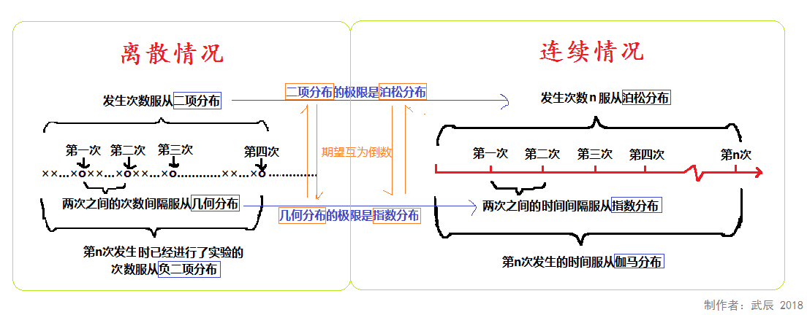

# 泊松分布、指数分布、二项分布的关系、用途

要理解泊松分布、指数分布、二项分布的关系与用途，需从**“计数”与“时间/间隔”的统计逻辑**切入——三者本质是对“独立随机事件”在不同维度（次数、间隔）的概率描述，且存在明确的推导与转化关系。以下分“关系”和“用途”两部分，结合定义、公式和案例详细说明。

### 一、三者的核心关系：从“二项分布”到“泊松分布”，再到“指数分布”
三者的逻辑链条可概括为：**二项分布（有限次独立试验的“成功次数”）→ 泊松分布（无限次试验的“稀有事件次数”）→ 指数分布（泊松事件的“时间间隔”）**。具体推导与关联如下：

#### 1. 基础：二项分布（Binomial Distribution）
二项分布是“n次独立重复试验（伯努利试验）中，成功次数X的概率分布”，需满足3个条件：
- 试验次数**有限（n为固定正整数）**；
- 每次试验只有“成功（概率p）”或“失败（概率1-p）”两种结果；
- 每次试验的成功概率p**固定**，且试验间相互独立。

其概率质量函数（PMF，描述离散变量取某值的概率）为：  
$$P(X=k) = C_n^k \cdot p^k \cdot (1-p)^{n-k}$$  
其中 $C_n^k = \frac{n!}{k!(n-k)!}$（组合数，表示从n次试验中选k次成功的方式数），$k=0,1,2,...,n$。

#### 2. 二项分布的极限：泊松分布（Poisson Distribution）
当二项分布的**试验次数n趋近于无穷大（n→∞）**，且**成功概率p趋近于0（p→0）**，但两者的乘积（即“平均成功次数”λ = n·p）保持为固定常数时，二项分布会“收敛”到泊松分布。  

泊松分布描述的是：**“单位时间/空间内，稀有事件发生次数X的概率分布”**，核心是“事件稀有但试验次数极多”（如“1小时内网站崩溃次数”“1平方米布料的瑕疵数”）。

其概率质量函数（PMF）为：  
$$P(X=k) = \frac{e^{-\lambda} \cdot \lambda^k}{k!}$$  
其中 $\lambda$（lambda）是“单位时间/空间内事件的平均发生次数”（核心参数），$e≈2.718$（自然常数），$k=0,1,2,...$（事件发生次数，可无限大）。

**关键关联**：泊松分布是二项分布的“极限近似”——当n≥20且p≤0.05时，用泊松分布近似二项分布的误差已很小（如“1000次抽奖，中奖概率0.01，中奖次数X可近似用λ=10的泊松分布描述”）。

#### 3. 泊松分布的延伸：指数分布（Exponential Distribution）
指数分布是对“泊松事件的时间间隔”的描述——若“单位时间内事件发生次数X服从泊松分布”，则“两次相邻事件的时间间隔T”服从指数分布。  

指数分布的核心是**“无记忆性”**：即“从当前时刻开始，等待下一个事件发生的时间分布，与之前已等待的时间无关”（如“已知设备已运行100小时，再运行50小时的概率，等于设备全新时运行50小时的概率”）。

其概率密度函数（PDF，描述连续变量的概率分布）为：  
$$f(t) = \lambda e^{-\lambda t} \quad (t ≥ 0)$$  
累积分布函数（CDF，描述“时间≤t”的概率）为：  
$$F(t) = 1 - e^{-\lambda t} \quad (t ≥ 0)$$  
其中 $\lambda$ 与泊松分布的参数完全一致（单位时间内事件的平均发生次数），$t$ 是“两次事件的时间间隔”（连续变量，≥0）。

#### 三者关系总结表
| 维度                | 二项分布                  | 泊松分布                  | 指数分布                  |
|---------------------|---------------------------|---------------------------|---------------------------|
| **描述对象**        | n次试验的“成功次数”（离散） | 单位时空的“事件次数”（离散） | 泊松事件的“时间间隔”（连续） |
| **核心参数**        | n（试验次数）、p（成功概率） | λ（平均事件数）           | λ（平均事件数/单位时间）  |
| **与二项分布的关系** | 基础分布                  | 二项分布的极限（n→∞, p→0） | 泊松分布的“间隔分布”      |
| **关键性质**        | 有限取值（0~n）           | 无限取值（0,1,2...）      | 无记忆性                  |
| **变量类型**        | 离散型                    | 离散型                    | 连续型                    |

### 二、三者的核心用途：从“次数统计”到“间隔预测”
三者的用途严格对应其描述对象，且常结合使用（如用泊松分布统计事件次数，再用指数分布预测下一次事件的时间）。

#### 1. 二项分布：有限次独立试验的“成功次数”预测
适用于**试验次数固定、结果二元、概率稳定**的场景，核心是计算“某次数成功”的概率。  
典型案例：
- 质量检测：100件产品（n=100），次品率5%（p=0.05），求“恰好3件次品”的概率；
- 市场营销：给1000个客户发推广短信（n=1000），转化率2%（p=0.02），求“至少25人转化”的概率；
- 游戏概率：某抽奖活动（n=10次），中奖概率10%（p=0.1），求“至少中奖1次”的概率（用1-P(X=0)计算）。

#### 2. 泊松分布：稀有事件的“次数统计”
适用于**试验次数极多、事件概率极低、平均次数已知**的场景，核心是描述“单位时空内稀有事件的发生频率”。  
典型案例：
- 服务行业：某银行1小时内平均叫号30人（λ=30），求“1小时内叫号不超过25人”的概率；
- 故障统计：某服务器平均每天崩溃2次（λ=2），求“1天内崩溃≥3次”的概率；
- 自然灾害：某地区平均每年发生2次地震（λ=2），求“1年内无地震”的概率（P(X=0)=e⁻²≈0.135）。

**注意**：泊松分布的“单位”可灵活定义（如“1平方米”“1升水”“1个月”），只要λ是“该单位内的平均事件数”。

#### 3. 指数分布：事件间隔的“时间预测”
适用于**基于泊松事件的间隔时间分析**，核心是利用“无记忆性”预测“下一次事件发生的时间”。  
典型案例：
- 设备维护：某机器平均每1000小时故障1次（λ=1/1000 次/小时），求“机器连续运行1500小时无故障”的概率（用CDF计算：$1-F(1500)=e^{-\frac{1}{1000}×1500}≈0.223$）；
- 排队系统：某奶茶店平均每5分钟来1位顾客（λ=0.2 人/分钟），求“下一位顾客10分钟内到达”的概率（$F(10)=1-e^{-0.2×10}≈0.865$）；
- 电子元件寿命：某电池平均寿命200天（λ=1/200 天⁻¹），求“电池已用100天，再用100天”的概率（无记忆性，等于“新电池用100天”的概率：$1-F(100)=e^{-0.5}≈0.607$）。

### 三、一句话总结逻辑链
- 想知道“10次抛硬币中正面朝上的次数”→ 用**二项分布**；
- 想知道“1年中某路口发生交通事故的次数”（次数多、概率低）→ 用**泊松分布**（可看作二项分布的极限）；
- 想知道“该路口两次交通事故之间间隔的时间”→ 用**指数分布**（泊松事件的间隔分布）。