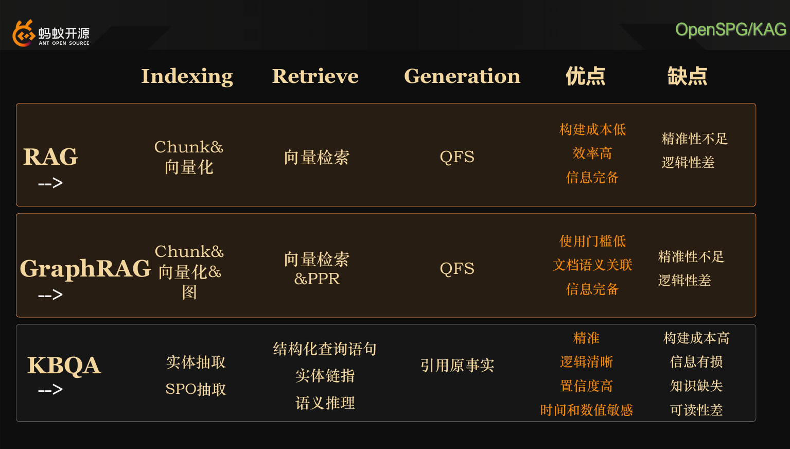
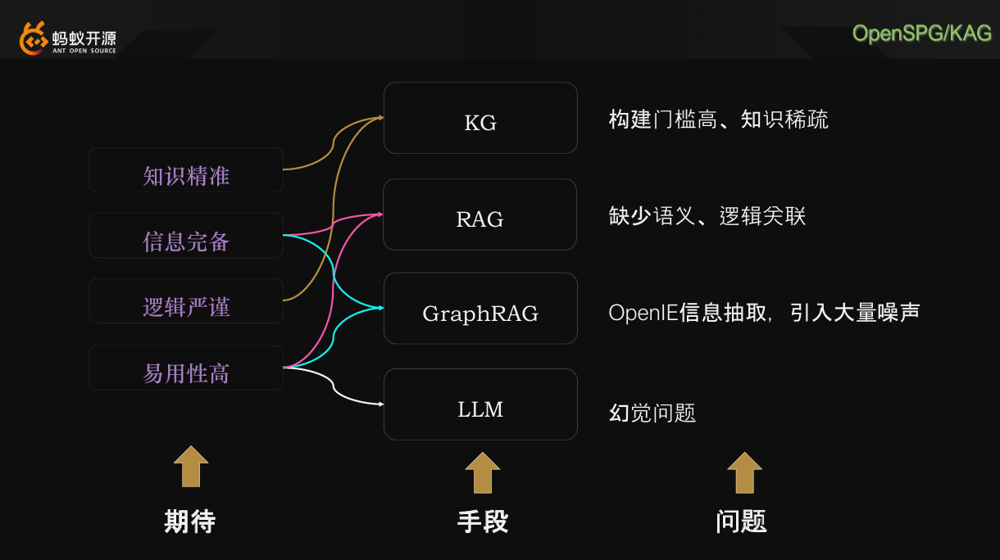
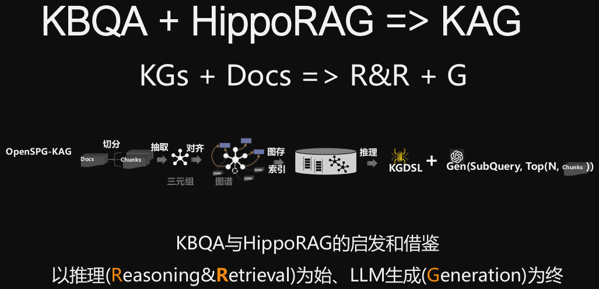

# 介绍 LLM、RAG、Agent、Memory、Retrieval、KG 等相关技术的融合

---

## 腾讯 tree graphrag （2025年9月）
https://mp.weixin.qq.com/s/Ddf3rpdJP8P_L5yaPnBFBA

## 自己用milvus+neo4j实现graphrag
https://github.com/milvus-io/bootcamp/blob/master/bootcamp/RAG/advanced_rag/langgraph-graphrag-agent-local.ipynb

## awesome-ai-memory 汇聚memory相关项目
https://github.com/topoteretes/awesome-ai-memory

## es agent
基于 Langchain 的 Elasticsearch Agent 对文档的搜索
https://elasticstack.blog.csdn.net/article/details/136253286

## MINE Context
万物皆可上下文， 挖掘上下文
https://github.com/volcengine/MineContext/tree/main?tab=readme-ov-file
https://github.com/volcengine/MineContext/blob/main/README_zh.md

## mem0 2025年9月27日持续更新github
基于graph+rag的mem0
https://github.com/mem0ai/mem0

## 蚂蚁 KAG
https://github.com/orgs/OpenSPG/discussions/52

KAG客户端 使用方式：
https://github.com/1850298154/KagTest

参考 HippoRAG
https://github.com/OSU-NLP-Group/HippoRAG
https://dl.acm.org/doi/10.5555/3737916.3739818

## 如何基于语义相似性分割文本
RAG分割文档的几种方式：
1. 基于语义相似性的分割文本
https://python.langchain.ac.cn/docs/how_to/semantic-chunker/
2. 其他（基于固定长度、基于滑动窗口、基于标题等）

## 各种向量数据库对比
https://www.cnblogs.com/crazymakercircle/p/18867143

## 基于hnswlib的向量索引(2年前更新)
https://github.com/nmslib/hnswlib

## stream vq 生成式召回
https://zhuanlan.zhihu.com/p/1955356511661458958

## ai学术搜索
官网地址是：https://lumina.sh，可直接访问使用这款免费学术搜索引擎。

## nlp etc.
https://www.geeksforgeeks.org/category/nlp/

## 知识图谱 - 北京大学大数据分析与应用技术国家工程实验室成员，  包括各种知识图谱抽取+检索，neo4j+MongoDB等
https://liuhuanyong.github.io/

## 唐国梁Tommy : rag + llm + es
https://github.com/TGLTommy?tab=repositories

https://www.youtube.com/@TGLTommy

唐国梁Tommy官方网站
tgltommy.com

微信公众号
tgltommy.com/p/official-wechat

bilibili
space.bilibili.com/474347248

## 长文本提取结构化信息
项目 GitHub 地址：github.com/google/LangExtract  
PyPI 安装命令：pip install langextract

## 非结构化转结构化，用于微调等
Easy Workspace工具，它能自动将PDF、Word等非结构化数据转化为结构化微调训练数据。通过三步流程：数据标准化、内容提取分割、生成问答对，帮助企业高效完成大模型微调，显著降低人工成本。

## MongoDB + ES 向量存储 + 文本分割器SpacyTextSplitter （24年6月11日）
https://www.53ai.com/news/LargeLanguageModel/2024061171948.html

## ai coding

Roo Code

Cline

Kilo

Metamove

# 知名服务商

---

## 阿里 mem0 milvus
https://mp.weixin.qq.com/s/0l6TP8DjArNwulMfFNlw1A

# 面试指南

---

### 飞书文档

> https://v11enp9ok1h.feishu.cn/wiki/KiIvwdFOciiqqNkwKzTcmn88ndL

> https://kwz55xptfhg.feishu.cn/wiki/T5oew0kY4in3EIk1Wlfc3oIGnhe

> https://gxvezr0dpem.feishu.cn/docx/BE1YdDKeOoNZcvxeidccwJ65nnc

