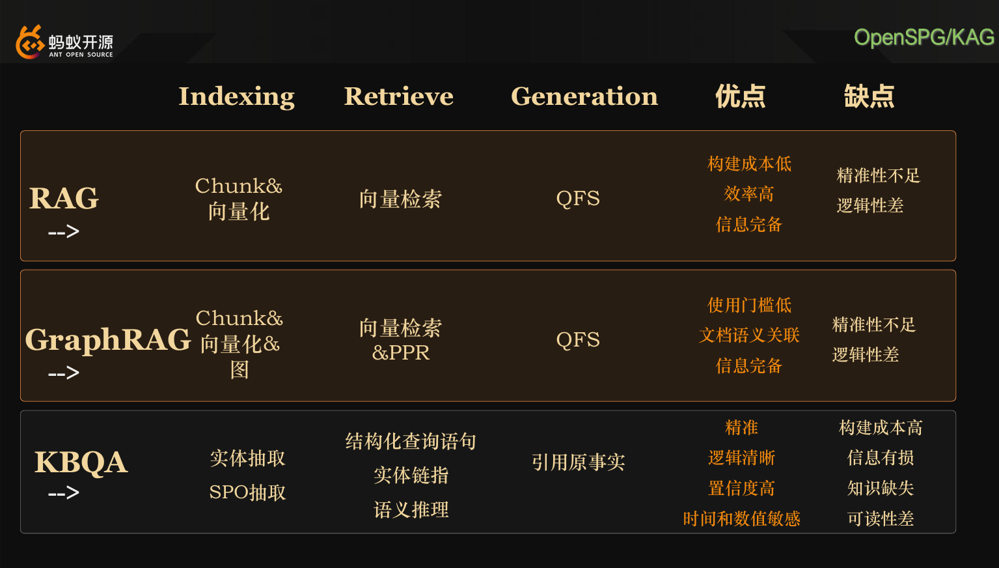
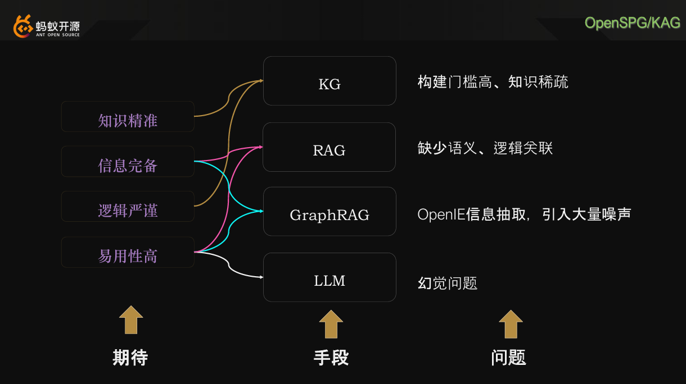
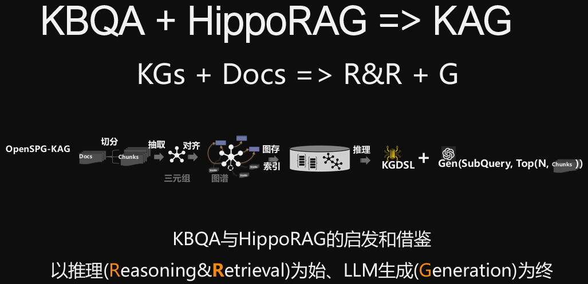

# 1. 介绍 LLM、RAG、Agent、Memory、Retrieval、KG 等相关技术的融合
---
- [1. 介绍 LLM、RAG、Agent、Memory、Retrieval、KG 等相关技术的融合](#1-介绍-llmragagentmemoryretrievalkg-等相关技术的融合)
  - [1.1. 2025年11月13截止之前的memory 方案汇总对比](#11-2025年11月13截止之前的memory-方案汇总对比)
  - [读论文+github 神器 deepwiki](#读论文github-神器-deepwiki)
  - [verl](#verl)
  - [pageindex](#pageindex)
  - [1.2. PostgreSQL == 多合一数据库：用插件替代专用数据库](#12-postgresql--多合一数据库用插件替代专用数据库)
    - [1.2.1. 官网](#121-官网)
    - [1.2.2. 完整对应清单](#122-完整对应清单)
    - [1.2.3. 关键插件详解（生产级选型）](#123-关键插件详解生产级选型)
      - [1.2.3.1. 替代 InfluxDB（时序数据库）](#1231-替代-influxdb时序数据库)
      - [1.2.3.2. 替代 Milvus（向量数据库）](#1232-替代-milvus向量数据库)
      - [1.2.3.3. 替代 Neo4j（图数据库）+ pgRouting（地理路由）](#1233-替代-neo4j图数据库-pgrouting地理路由)
      - [1.2.3.4. 替代 Redis（缓存/高性能读写）](#1234-替代-redis缓存高性能读写)
      - [1.2.3.5. 替代 Elasticsearch（全文检索/搜索引擎）](#1235-替代-elasticsearch全文检索搜索引擎)
      - [1.2.3.6. 替代 MongoDB（文档数据库）](#1236-替代-mongodb文档数据库)
    - [1.2.4. 补充说明](#124-补充说明)
  - [1.3. agent memory方向主要有2个：](#13-agent-memory方向主要有2个)
  - [1.4. 长记忆开源方案update](#14-长记忆开源方案update)
  - [1.5. Improving Language Agents through BREW](#15-improving-language-agents-through-brew)
  - [1.6. llm各种框架和论文，4000+⭐](#16-llm各种框架和论文4000)
  - [1.7. agent evolver](#17-agent-evolver)
  - [1.8. 微软 agent](#18-微软-agent)
  - [1.9. 谷歌新研究定义"充分上下文"：](#19-谷歌新研究定义充分上下文)
  - [1.10. EverMemOS](#110-evermemos)
  - [1.11. MCP 生态链接](#111-mcp-生态链接)
  - [1.12. 之后是2025年11月13之前汇总](#112-之后是2025年11月13之前汇总)
  - [1.13. 综述](#113-综述)
  - [1.14. context-labs / aella-data-explorer 1亿篇论文组成知识图谱KG](#114-context-labs--aella-data-explorer-1亿篇论文组成知识图谱kg)
  - [1.15. multi ai agent game](#115-multi-ai-agent-game)
  - [1.16. langchain 中间件](#116-langchain-中间件)
  - [1.17. todolist middleware](#117-todolist-middleware)
  - [1.18. 舆情分析](#118-舆情分析)
  - [1.19. LightMem：像人脑一样高效的记忆系统](#119-lightmem像人脑一样高效的记忆系统)
  - [1.20. llm训练](#120-llm训练)
  - [1.21. Prop RAG](#121-prop-rag)
  - [1.22. 基于多模态信息抽取的菜品知识图谱构建](#122-基于多模态信息抽取的菜品知识图谱构建)
  - [1.23. ragflow 已经支持 知识图谱](#123-ragflow-已经支持-知识图谱)
  - [1.24. flashrag](#124-flashrag)
  - [1.25. LightRAG](#125-lightrag)
  - [1.26. llm agent 综述](#126-llm-agent-综述)
  - [1.27. 谷歌 vs 微软 deepresearch](#127-谷歌-vs-微软-deepresearch)
  - [1.28. Reasoning with Sampling: Your Base Model is Smarter Than You Think](#128-reasoning-with-sampling-your-base-model-is-smarter-than-you-think)
  - [1.29. Agentic RAG新范式！天大\&小红书提出DecEx-RAG，剪枝搜索扩展提速6倍](#129-agentic-rag新范式天大小红书提出decex-rag剪枝搜索扩展提速6倍)
  - [1.30. 日报神器，记录你的一天 Dayflow](#130-日报神器记录你的一天-dayflow)
  - [1.31. 可信AI Agent相关论文(DPO)](#131-可信ai-agent相关论文dpo)
  - [1.32. Graph-Base Agent基于任务图的Agent框架](#132-graph-base-agent基于任务图的agent框架)
  - [1.33. A-Mem: Agentic Memory for LLM Agents](#133-a-mem-agentic-memory-for-llm-agents)
  - [1.34. logic rag](#134-logic-rag)
  - [1.35. LightMem](#135-lightmem)
  - [1.36. langchain graphrag](#136-langchain-graphrag)
  - [1.37. G-memory, Arcmemo, reasoning bank](#137-g-memory-arcmemo-reasoning-bank)
  - [1.38. embedding model 天梯](#138-embedding-model-天梯)
  - [1.39. MonkeyOCR](#139-monkeyocr)
  - [1.40. GitHub代码检索](#140-github代码检索)
  - [1.41. 视频转文字](#141-视频转文字)
  - [1.42. 音视频2文本](#142-音视频2文本)
  - [1.43. 爬虫数据采集圣器](#143-爬虫数据采集圣器)
  - [1.44. ai伴侣](#144-ai伴侣)
  - [1.45. metaGPT](#145-metagpt)
  - [1.46. unsloth](#146-unsloth)
  - [1.47. ai 知识库](#147-ai-知识库)
  - [1.48. 高质量rag](#148-高质量rag)
  - [1.49. ai混合搜索 meili](#149-ai混合搜索-meili)
  - [1.50. mem 推移学习，自我改进](#150-mem-推移学习自我改进)
  - [1.51. 腾讯 tree graphrag （2025年9月）](#151-腾讯-tree-graphrag-2025年9月)
  - [1.52. Graphiti vs GraphRAG 对比](#152-graphiti-vs-graphrag-对比)
  - [1.53. 自己用milvus+neo4j实现graphrag](#153-自己用milvusneo4j实现graphrag)
  - [1.54. 微软 graphRAG](#154-微软-graphrag)
  - [1.55. awesome-ai-memory 汇聚memory相关项目](#155-awesome-ai-memory-汇聚memory相关项目)
  - [1.56. es agent](#156-es-agent)
  - [1.57. MINE Context](#157-mine-context)
  - [1.58. 拼好rag](#158-拼好rag)
  - [1.59. mem0 2025年9月27日持续更新github](#159-mem0-2025年9月27日持续更新github)
  - [1.60. 蚂蚁 KAG](#160-蚂蚁-kag)
  - [1.61. 如何基于语义相似性分割文本](#161-如何基于语义相似性分割文本)
  - [1.62. 各种向量数据库对比](#162-各种向量数据库对比)
  - [1.63. 基于hnswlib的向量索引(2年前更新)](#163-基于hnswlib的向量索引2年前更新)
  - [1.64. stream vq 生成式召回](#164-stream-vq-生成式召回)
  - [1.65. ai学术搜索](#165-ai学术搜索)
  - [1.66. nlp etc.](#166-nlp-etc)
  - [1.67. 知识图谱 - 北京大学大数据分析与应用技术国家工程实验室成员，  包括各种知识图谱抽取+检索，neo4j+MongoDB等](#167-知识图谱---北京大学大数据分析与应用技术国家工程实验室成员--包括各种知识图谱抽取检索neo4jmongodb等)
  - [1.68. 唐国梁Tommy : rag + llm + es](#168-唐国梁tommy--rag--llm--es)
  - [1.69. 长文本提取结构化信息](#169-长文本提取结构化信息)
  - [1.70. 非结构化转结构化，用于微调等](#170-非结构化转结构化用于微调等)
  - [1.71. MongoDB + ES 向量存储 + 文本分割器SpacyTextSplitter （24年6月11日）](#171-mongodb--es-向量存储--文本分割器spacytextsplitter-24年6月11日)
  - [1.72. ai coding](#172-ai-coding)
- [2. ai agent 架构、新闻DIY、产品汇总](#2-ai-agent-架构新闻diy产品汇总)
  - [2.1. ai agent 架构](#21-ai-agent-架构)
    - [2.1.1. roma 等（字节aime，分析计划树agent）](#211-roma-等字节aime分析计划树agent)
    - [2.1.2. 数分+营销](#212-数分营销)
  - [2.2. 其他人 ai hub](#22-其他人-ai-hub)
  - [2.3. 令人启发的产品](#23-令人启发的产品)
    - [2.3.1. 用知识卡片，轻松建立知识体系](#231-用知识卡片轻松建立知识体系)
    - [2.3.2. 教育](#232-教育)
    - [2.3.3. 学术](#233-学术)
  - [2.4. ai agent 新闻频道](#24-ai-agent-新闻频道)
    - [2.4.1. aihub (外国日报)](#241-aihub-外国日报)
    - [2.4.2. ai 技术新闻（英国）](#242-ai-技术新闻英国)
    - [2.4.3. github ai  (外国日报论坛)](#243-github-ai--外国日报论坛)
    - [2.4.4. ai tool navigation (中国一站式)](#244-ai-tool-navigation-中国一站式)
- [3. 知名服务商](#3-知名服务商)
  - [3.1. 阿里 mem0 milvus](#31-阿里-mem0-milvus)
- [4. AI 指南 + 面试指南](#4-ai-指南--面试指南)
    - [4.0.1. 飞书文档](#401-飞书文档)
    - [4.0.2. 马士兵飞书](#402-马士兵飞书)
- [5. 基础](#5-基础)
  - [5.1. 统计学自学指南 stats-self-learning](#51-统计学自学指南-stats-self-learning)


---

## 1.1. 2025年11月13截止之前的memory 方案汇总对比
- **AI Memory 项目完整对照表**
- 一、🔥开源记忆框架推荐
  - 1 MemOS
    - 团队：记忆张量 + 上海交大等
    - 类型：记忆操作系统
    - 核心：三层架构 + 记忆调度
    - 特点：工业级标准化封装（MemCube）
    - 性能：准确率提升 38.97%，Token 消耗降低 60.95%
    - 适用场景：企业级生产环境
    - 发布时间：2025 年 7 月
  - 2 Mem0
    - 团队：YC 支持创业公司
    - 类型：混合存储框架
    - 核心：向量 + 键值 + 图存储
    - 特点：响应 1.44 秒，7k tokens/对话
    - 适用：企业多场景应用
    - Stars：22k+
  - 3 Zep (Graphiti)
    - 团队：YC 2024 冬季批次
    - 类型：时序知识图谱
    - 特点：关系追踪准确率 94.8%，DMR 基准 98.2%
    - 场景：复杂多会话关系管理
  - 4 Letta (MemGPT)
    - 来源：UC Berkeley
    - 特点：分层内存 + 可视化 ADE 界面
    - 适用：学术与代理框架开发
  - 5 Cognee
    - 特点：图 + 向量混合架构，ECL 知识管道
    - 准确率：92.5%（优于传统 RAG）
    - 适用：知识密集型场景
  - 其他代表：
    - LangMem（LangChain 官方 SDK）
    - Memoripy（人类记忆模拟）
    - Memori（企业集成引擎）
    - Memory（图数据库驱动）
    - Julep AI（AI 工作流平台）
- 二、🧠 MCP 记忆服务器生态
  - 1 OpenMemory MCP（Mem0 官方）
    - 技术：本地优先 + 标准化 API
    - 优点：完全离线、零云同步
    - 场景：隐私敏感场景、跨工具协作
  - 2 Supermemory MCP
    - 支持跨 LLM 平台共享记忆
    - 场景：ChatGPT、Claude、Gemini 混合使用者
  - 3 CaviraOSS OpenMemory
    - 优点：速度提升 2-3 倍，成本降低 6-10 倍
    - 场景：性能优先的企业环境
  - 4 Basic Memory
    - 存储：Markdown + 知识图谱
    - 优点：兼容 Obsidian
    - 适用：个人知识管理
- 三、🏢 商业产品的记忆功能
  - ChatGPT Memory（OpenAI）
    - 自动预加载 + 时间戳记忆
    - 跨对话持久保存
    - 用户可随时删除
    - ✅ 全量开放中
  - Claude Memory（Anthropic）
    - 工具调用 + 原始对话引用
    - 团队版增强，安全测试完善
  - Gemini Memory（Google）
    - 功能未完全上线，仍在测试中
- 四、💻 桌面与独立应用
  - Memorr.ai
    - 平台：Mac / Windows
    - 技术：RAG + 可视化记忆画布
    - 特点：永久记忆、本地加密
    - 场景：长对话用户
- 五、🎓 学术研究与创新架构
  - Memory Taxonomy 2025（爱丁堡大学+港中文）：三大记忆分类与六种操作
  - 3DLLM-MEM（UCLA+Google）：3D 环境长时记忆，用于机器人
  - MIRIX（UCSD+NYU）：多模态多智能体记忆系统
  - Larimar：大脑启发架构，分布式情景记忆
  - MemoryOS（北邮团队）：三级分层记忆架构
- 六、📊 评估基准
  - LoCoMo（ACL 2024）：长期对话记忆
  - LongMemEval：时序推理能力测试
  - DMR（MemGPT 团队）：多会话深度记忆检索
- 七、🧩 技术架构对比
  - 架构类型对比：
    - 向量检索：高效快速
    - 图数据库：关系建模最强
    - 混合架构：性能平衡
    - 操作系统级：调度优化显著
    - 代理框架型：灵活度高
  - 代表项目：
    - Mem0（混合）
    - Zep（图时序）
    - MemOS（系统级）
    - Cognee（混合）
    - Letta（代理框架）
- 八、🧭 选择建议矩阵
  - 个人助手：ChatGPT Memory / Claude Memory
  - 专业开发：LangMem / Cognee / Mem0
  - 企业生产：MemOS / Zep / Memori
  - 隐私场景：OpenMemory MCP / Memoripy
  - 跨工具协作：Supermemory MCP
  - 复杂工作流：Julep AI
  - 学术研究：Letta (MemGPT)
- 九、🚀 性能数据对比（简化版）
  - MemOS：准确率 +38.97%，Token -60.95%
  - Cognee：准确率 92.5%
  - Zep：DMR 98.2%
  - Mem0：LoCoMo 68.5%，响应 1.44s
  - OpenMemory (CaviraOSS)：2-3 倍更快，6-10 倍成本优势
- 十、🔗 集成生态对比
  - LangChain / LangGraph / CrewAI / AutoGen / MCP
  - ✅ MemOS、Mem0、Zep、Cognee、LangMem 均深度集成 LangChain
  - ✅ OpenMemory、Supermemory 专注 MCP 生态
- 十一、📂 数据存储架构
  - MemOS：全栈（向量+图+关系+键值）
  - Zep / Cognee / Memory：图+向量混合
  - Memori：SQLite 本地轻量方案
  - Basic Memory：Markdown 文件存储
- 十二、⚖️ 开源协议与商业模式
  - Apache 2.0：Mem0, Zep, Cognee, Letta, Julep
  - MIT：LangMem, Memoripy
  - 商业版：MemOS, Memori
  - 云服务支持：Mem0, Zep, Julep
- 十三、📈 技术趋势总结（2025）
  - 1 架构趋势：图 + 向量混合成主流，记忆系统操作系统化
  - 2 标准化：MCP 成为事实标准
  - 3 隐私优先：数据主权与本地控制成刚需
  - 4 性能优化：Token 成本降低 60%，速度提升 3 倍
  - 5 生态融合：LangChain / LangGraph / MCP 多平台互通
- 十四、🌳 快速选择指南
  - 想要“零配置”：选 ChatGPT Memory
  - 追求隐私安全：选 Memoripy / Basic Memory
  - 开发实验：选 LangMem / Cognee / Mem0
  - 企业生产：选 MemOS / Zep / Memori
  - 跨工具协作：选 Supermemory MCP
  - 工作流自动化：选 Julep AI

## 读论文+github 神器 deepwiki
首页： [deepwiki](https://deepwiki.com/)

## verl
[verl](https://mp.weixin.qq.com/s/KllfYqWI5ljqd1YtPEViTA)

- 定位：veRL（Volcano Engine Reinforcement Learning）是字节跳动火山引擎于 2024 年底开源的分布式大模型强化学习训练框架。其设计目标是将 RLHF 的科研实现转化为可规模化部署的生产级系统。
- 核心功能：veRL 的核心模块包括 Rollout 生成器、奖励建模器、策略更新器、分布式调度器。它支持多种算法，如 PPO、DPO、DAPO （Dynamic Alignment Policy Optimization）和 GRPO，并通过异步管线方式加速训练。其架构借鉴了工业级 RL 系统（如 DeepMind Acme、OpenAI RLHF pipeline），可在数百张 GPU 上同时运行。
- 技术特点与用途：veRL 面向企业和研究机构的“大规模模型后训练”场景。其分布式框架支持任务并行、异步更新和奖励缓存机制，可显著降低 GPU 闲置率。其 DAPO 算法被广泛用于 Qwen 系列模型中，以优化推理稳定性与语言一致性。

##  pageindex
地址：https://github.com/VictifyAl/PageIndex

在处理专业长文档时，传统基于向量的检索增强生成（RAG）系统依赖语义相似性，而非真正的相关性。然而，相似性并不等同于相关性，我们在检索中真正需要的是相关性，而这需要推理。为了解决这一问题，VectifyAI 推出了 PageIndex，一个基于推理的 RAG 系统，它能为长文档构建树状索引，并通过该索引进行检索。


## 1.2. PostgreSQL == 多合一数据库：用插件替代专用数据库
### 1.2.1. 官网
- [postgres新功能 ai ](https://supabase.com/blog/postgres-new)
- [postgres chat db](https://database.build/)
- [postgres 新功能 ai 集成](https://blog.adyog.com/2024/09/14/exploring-postgres-new-in-browser-postgres-with-ai-integration/)
- [rag-memory with postgresql + neo4j](https://pypi.org/project/rag-memory/)

PostgreSQL 凭借丰富的插件生态，能够一站式替代时序数据库、向量数据库、图数据库、缓存、搜索引擎、文档数据库等多种专用数据库。以下是精准的插件对应关系补全，兼顾功能匹配度和生产级可用性：

### 1.2.2. 完整对应清单
替代数据库      | 插件 （索引）                                         | 说明    
----------------|--------------------------------------------------|------------------------------
**InfluxDB** |  (TimescaleDB / BRIN)                                 | 时序数据库：TimescaleDB（官方核心时序插件） + BRIN（轻量级时序索引）
**Milvus** |  (pgvector)                                            | 向量数据库：pgvector（PostgreSQL官方生态向量插件）
**Neo4j** |  (pgRouting + pg_graph)                                 | 图数据库/空间路由：pgRouting（地理路由）+ pg_graph（原生图处理）
**Redis** |  (pg_repack + pg_cron + redis_fdw)                      | 缓存/定时任务：redis_fdw（Redis双向访问）+ pg_repack（数据优化）+ pg_cron（定时任务）
**SQL** |  (原生PostgreSQL = B-Link树 )                               | 关系型SQL：PostgreSQL原生SQL引擎（兼容SQL:2016）：B-Link树索引 数字文本
**Elasticsearch** |  (PGroonga + pg_bigm + tsvector/tsquery / GIN)  | 搜索引擎：PGroonga（全文检索）+ pg_bigm（模糊匹配）+ 原生tsvector（文本索引） + GIN（通用索引）
**MongoDB** |  (jsonb + pg_json_schema + mongodb_fdw)                 | 文档数据库：jsonb（原生JSONB类型）+ pg_json_schema（JSON校验）+ mongodb_fdw（MongoDB互通）
**定时任务数据库** |(pg_cron + pg_timetable + pgAgent + pg_jobmon)      | 定时任务/调度数据库 ：pg_cron（轻量级定时任务）+ pg_timetable（复杂调度）+ pgAgent（图形化调度）+ pg_jobmon（任务监控）
**地理位置** |(GIST)                                                  | 地理位置索引：GIST（通用空间索引），支持点、线、多边形等空间数据，可与pgRouting等插件配合使用。


### 1.2.3. 关键插件详解（生产级选型）
#### 1.2.3.1. 替代 InfluxDB（时序数据库）
- **核心插件**：`TimescaleDB`  
  官方专为PostgreSQL打造的时序数据库扩展，支持自动分区、数据保留策略、时序聚合函数（如time_bucket），完全对标InfluxDB的时序场景（物联网、监控指标等）。

#### 1.2.3.2. 替代 Milvus（向量数据库）
- **核心插件**：`pgvector`  
  目前最成熟的PostgreSQL向量插件，支持向量存储、余弦/欧氏/内积相似度计算，兼容OpenAI等大模型Embedding向量，性能接近Milvus，且可与关系数据联动。

#### 1.2.3.3. 替代 Neo4j（图数据库）+ pgRouting（地理路由）
- **图处理**：`pg_graph`（PostgreSQL 14+原生图类型） + `age`（Apache AGE，兼容Cypher查询语言）  
- **地理路由**：`pgRouting`（经典插件，支持最短路径、TSP等地理路由算法，替代Neo4j的空间路由能力）

#### 1.2.3.4. 替代 Redis（缓存/高性能读写）
- **缓存互通**：`redis_fdw`（Foreign Data Wrapper，实现PostgreSQL与Redis双向数据访问）  
- **高性能读写**：`pg_prewarm`（数据预热到内存） + `pg_stat_statements`（性能监控）  
- **定时任务**：`pg_cron`（替代Redis的定时任务能力）

#### 1.2.3.5. 替代 Elasticsearch（全文检索/搜索引擎）
- **核心插件**：`PGroonga`（基于Groonga的高性能全文检索，支持中文分词、模糊匹配、高亮）  
- **轻量替代**：PostgreSQL原生`tsvector/tsquery`（文本索引） + `pg_bigm`（双字符索引，优化中文模糊查询）  
- **分布式检索**：`Citus`（分库分表）+ PGroonga（分布式检索）

#### 1.2.3.6. 替代 MongoDB（文档数据库）
- **核心能力**：PostgreSQL原生`jsonb`类型（支持索引、嵌套查询、JSON操作符）  
- **增强插件**：  
  - `pg_json_schema`（JSON Schema校验，替代MongoDB的文档校验）  
  - `mongodb_fdw`（MongoDB数据接入PostgreSQL）  
  - `jsonb_plpython`（自定义JSON处理函数）

### 1.2.4. 补充说明
1. **原生能力优先**：PostgreSQL的jsonb、tsvector、地理信息（PostGIS）等原生功能已覆盖大部分专用数据库场景，插件仅作增强；
2. **生产兼容性**：上述插件均为社区成熟方案，TimescaleDB、pgvector、PGroonga等已在企业级场景大规模落地；
3. **优势**：PostgreSQL通过插件实现“一站式”数据存储，避免多数据库同步的复杂度，同时保留SQL的通用性和事务一致性。


## 1.3. agent memory方向主要有2个：
```
模型驱动：深入模型底层动刀，从根本上增强其记忆能力。
应用驱动：在应用层搭建即插即用的记忆框架。
.
✅针对这两大方向做了完整整理，以一些比较核心的工作举例。
.
⭕模型驱动——深入骨髓的记忆改造 (5个典型工作)
这一方向主要是直接改造大模型，让模型“天生”就拥有更强的记忆力。优点是性能上限高，缺点是研发成本高、周期长。
1️⃣Memorizing Transformers (Google, 2022): 融合外部记忆（KNN查找）与内部注意力，让模型能边思考边“翻书”。
2️⃣MemoryLLM (清华, 2024): 在模型每层嵌入可读写的 "memory tokens"，像给大脑装了内置“草稿纸”。
3️⃣Memory³ (记忆弧量, 2024): 首次提出记忆分层框架，模拟人脑对记忆进行分层管理，让记忆组织更有条理。
4️⃣WISE (浙大, 2024): 提出“主记忆+侧记忆”双参数体系，面向终身学习和模型编辑。
5️⃣Titans (Google, 2025): 提出一个专用的神经网络模块，自主学习何时存储、何时遗忘。
.
⭕应用驱动——即插即用的记忆外挂 (5个典型工作)
这一方向偏向不动模型本身，在应用层构建记忆系统。优点是落地快、易扩展，缺点是受限于底层模型的能力。
1️⃣MemGPT (2023): 将LLM视为一个操作系统，通过虚拟上下文管理技术，赋予Agent无限上下文能力。
2️⃣Mem0 (2024): 一个为生产环境设计的通用记忆层，强调平台化服务与可扩展性。
3️⃣Zep (2024): 采用时序知识图谱（Temporal Knowledge Graph）来组织长期记忆，使记忆检索和理解更深刻。
4️⃣Memobase (2025): 基于用户画像（Profile）和事件（Event）构建长期记忆，能自动从对话中抽取结构化信息。
5️⃣HippoRAG (OSU等, 2024): 灵感源于神经生物学，模拟海马体的记忆形成机制。
```

## 1.4. 长记忆开源方案update
graphiti是主要做图。 [graphiti 播客](https://www.cnblogs.com/zzz77zz/articles/19026839)

memobase主要为了陪伴和个人助手场景设计

Memobase最近支持了event功能，可以记录用户记忆变动的时间发生顺序.
	
结合完全可定制的二级标签系统，大家可以使用memobase profile和event构建出灵活的长记忆AI

Memobase的时间记忆（temporal memory）居然领先  mem0, langmem, zep...


## 1.5. Improving Language Agents through BREW


微软：“经验”酿成“知识”让智能体聪明

BREW：把“经验”酿成“知识”——让语言智能体越用越聪明
问题 大模型智能体每次任务都从“零”开始，重复探索、API 冗余；权重级优化（PPO/GRPO）代价高、黑盒且难增量更新。

思路 不碰模型权重，而是持续蒸馏轨迹经验，构建可解释、模块化、可检索的知识库（KB），把“记忆”变成显式、可控的优化杠杆。

技术路线

Reflector-Agent：用人类规则+任务评分从轨迹中提取「概念-洞察」对，语义去重后得到元概念集合。
Integrator-Agent：为每个元概念维护独立文档，形成分区式 KB，支持精准更新与检索。

Expand-and-Gather MCTS：把 KB 精炼视为「文档状态空间搜索」，并行探索、全局同步，兼顾正确性与可检索性双目标奖励。
推理阶段：top-k 检索注入 prompt，零额外训练成本。

结果 在 OSWorld、τ²-Bench、SpreadsheetBench 三大真实环境上，任务成功率绝对提升 10–20 %，执行步数/对话轮次减少 10–15 %，计算开销与基座模型持平，显著优于现有记忆基线。
意义 首次将“智能体优化”转化为“可解释 KB 的状态搜索”，提供轻量、透明、可扩展的新范式，为长周期、高一致性、可审计的自主系统奠定基础。

## 1.6. llm各种框架和论文，4000+⭐
https://github.com/DSXiangLi/DecryptPrompt/blob/refs%2Fheads%2Fmain/%E5%BC%80%E6%BA%90%E6%A1%86%E6%9E%B6.MD
## 1.7. agent evolver
阿里通义实验室推出的AgentEvolver开源项目，能让AI智能体在闲置时自主生成任务、执行并进化。项目链接：https://github.com/modelscope/AgentEvolver


## 1.8. 微软 agent
https://github.com/microsoft/Generative-AI-for-beginners-dotnet/blob/refs%2Fheads%2Fmain/translations%2Ftw%2FREADME.md


##  1.9. 谷歌新研究定义"充分上下文"：
上下文需能推导出答案而非仅相关。发现即使上下文充足，大模型仍有14%-25%错误率。提出选择性生成框架，使模型准确率提升2-10%。

谷歌团队发表在ICLR 2025的新研究《Sufficient Context: A New Lens on Retrieval Augmented Generation Systems》，首次提出「充分上下文」（Sufficient Context）的核心概念，为这个行业痛点提供了全新解法，甚至能让Gemini、GPT等主流模型的正确回答率提升2-10%。

论文地址：https://arxiv.org/pdf/2411.06037

项目地址：https://github.com/hljoren/sufficientcontext

## 1.10. EverMemOS
陈天桥团队发布了EverMemOS，这是个开源的AI"记忆增强器"。它让AI告别"金鱼脑"，能长期记住信息、连贯思考，真正理解上下文。

EverMemOS深度整合MCP作为核心接口层，实现Cursor和Claude等工具间的记忆同步。比如能自动关联你上周查过的资料，这才是真正的"持久灵魂"，配置指南在GitHub仓库就能找到。


## 1.11. MCP 生态链接
- [MCP Python SDK](https://github.com/modelcontextprotocol/python-sdk)
- [FastMCP Documentation](https://github.com/jlowin/fastmcp)


## 1.12. 之后是2025年11月13之前汇总

## 1.13. 综述
《Agentic Retrieval-Augmented Generation: A Survey on Agentic RAG》

## 1.14. context-labs / aella-data-explorer 1亿篇论文组成知识图谱KG
https://github.com/context-labs/aella-data-explorer#:~:text=Interactive%20visualization%20and%20exploration%20of%20scientific%20papers%20from,project%20is%20a%20collaboration%20between%20Inference.net%20and%20LAION.

## 1.15. multi ai agent game
https://mp.weixin.qq.com/s/b005axpuXFno5h7gfC5DMg

## 1.16. langchain 中间件
https://langchain-doc.cn/v1/python/deepagents/middleware.html#%E6%96%87%E4%BB%B6%E7%B3%BB%E7%BB%9F%E4%B8%AD%E9%97%B4%E4%BB%B6

## 1.17. todolist middleware
https://deepwiki.com/langchain-ai/deepagents/2.5-planning-with-todolistmiddleware


## 1.18. 舆情分析
Agent自动生成舆情报告！ 项目地址：https://gitee.com/SeniorAgentTeam/bettafish-stock.git 不到两周狂揽2万Star的开源舆情分析平台，只需输入一句话，智能体就能自动爬取全网数据（微博、知乎、GitHub、抖音、小红书、官媒等），最后由Report Agent生成完整分析报告。 报告内容包含舆情发展脉络、传播分析、风险评估与应对策略，自动导出PDF。 

其中的5个智能体分工如下：

1. Insight Engine：负责私有数据库挖掘，处理企业内部业务数据，实现公私域数据融合

2. Media Engine：专注多模态内容分析，爬取抖音/快手/小红书的视频图文，还能解析搜索引擎中的天气卡、日历卡、股票卡等结构化信息

3. Query Engine：执行精准信息搜索，覆盖微博/知乎/GitHub等13+社媒平台，广泛采集用户评论和公开舆情

4. Forum Engine：担任"辩论主持人"，协调各Agent进行链式思维碰撞，避免单一模型局限

5. Report Engine：整合所有数据生成最终报告，包含舆情脉络、传播分析、风险评估等完整框架

这套系统通过五方协作，实现了从数据采集到深度分析的全流程自动化。

## 1.19. LightMem：像人脑一样高效的记忆系统
https://dailypapers.org/paper/2510.18866
	
🧠 核心方法
LightMem采用三阶段架构：
- 感官记忆： 轻量级压缩和主题过滤，快速去除冗余信息。
- 短期记忆： 主题感知整合，生成更结构化的记忆单元。
- 长期记忆： 引入“睡眠时间更新”机制，将昂贵的记忆维护操作解耦到离线并行执行，大幅降低在线延迟。

## 1.20. llm训练
必读系列，Huggingface 出品的 LLM 训练手册非常详细的介绍了完整的 LLM 训练流程，包括训练指南（是否需要预训练）、预训练、后训练、基础设施

主要以他们自己训练的 SmolLM3 这个 3B 模型为例子

手册包含了他们训练模型过程中对一系列决策、发现和死胡同的梳理，全是实践经验。

https://huggingface.co/spaces/HuggingFaceTB/smol-training-playbook

## 1.21. Prop RAG 
https://github.com/ReLink-Inc/PropRAG
核心创新：以"命题"为基础知识单元，通过无LLM的在线束搜索实现高效多跳推理
技术特点：
- 命题知识单元：将文档分解为语义丰富的命题，作为检索和推理的基本单位
- 束搜索算法：采用高效的束搜索在命题路径上进行多步推理，无需在线调用LLM
- 推理路径发现：能够自动发现和构建多步推理链，支持复杂问题解答

## 1.22. 基于多模态信息抽取的菜品知识图谱构建
https://tech.meituan.com/2024/05/17/cross-modal-ingredient-level-dataset.html

## 1.23. ragflow 已经支持 知识图谱
Construct knowledge graph

https://ragflow.io/docs/dev/construct_knowledge_graph

## 1.24. flashrag     
人大开源

https://github.com/RUC-NLPIR/FlashRAG

## 1.25. LightRAG
港大团队开源LightRAG：知识图谱+双层检索，复杂问答准确率飙升30%

LightRAG的主要优势包括：

- 高效的知识图谱构建：LightRAG通过图结构差异分析实现增量更新算法，显著降低了计算开销，使知识库维护更加高效。
- 双层检索机制：该系统结合了低层次（具体实体和属性）和高层次（广泛主题和概念）的检索策略，满足了不同类型的查询需求，提高了检索的全面性和多样性。
- 快速适应动态数据：LightRAG能够在新数据到来时快速整合，无需重建整个知识库，确保系统在动态环境中保持高效和准确。

LightRAG和GraphRAG的核心差异在于架构效率：GraphRAG依赖重型社区结构（单次检索耗61万token），而LightRAG用轻量图谱+双层检索（仅需百级token）。实验显示在法律数据集上，LightRAG以52.8%胜率小幅领先，多样性指标达73.6%碾压对手，且支持增量更新——用图谱的深度配合向量的速度，这才是生产环境该有的样子。


LightRAG用轻量图谱解决RAG语义碎片化问题。它通过实体关系提取和双层检索（既查具体实体又抓宏观关联），兼顾图谱深度与检索速度。相比传统扁平RAG，能挖掘数据间隐含因果链；相比GraphRAG，成本显著降低（检索仅需<100 token vs 61万）、支持增量更新。在法律等复杂领域胜率达52.8%，多样性73.6%。这种平衡使它更适合需频繁更新数据的实际业务场景，尤其适合既要精度又要效率的工业级应用。

https://link.zhihu.com/?target=https%3A//github.com/HKUDS/LightRAG

https://zhuanlan.zhihu.com/p/1892140189524156837

## 1.26. llm agent 综述
https://hustai.github.io/zh/posts/reasoning/LATS.html

## 1.27. 谷歌 vs 微软 deepresearch
 https://mp.weixin.qq.com/s/e_1dGQRLfc_fGAZrQEsLVw
## 1.28. Reasoning with Sampling: Your Base Model is Smarter Than You Think
哈佛团队的"Power Sampling"方法很妙：只需改变基座模型的采样分布（从常规改为幂分布），就能大幅提升推理能力。它不依赖强化学习、无需额外训练，连校验器都不用，却让Qwen2-5-Math-7B模型在数学任务准确率从49.6%跃升至74.8%，编程任务更是从21.3%飙升到73.2%——不仅逼近强化学习效果，还避免了多样性坍缩问题。这证明基础模型本身已蕴含强大推理潜力，只是被传统采样方式束缚住了。

## 1.29. Agentic RAG新范式！天大&小红书提出DecEx-RAG，剪枝搜索扩展提速6倍

## 1.30. 日报神器，记录你的一天 Dayflow
项目地址是
 https://github.com/JerryZLiu/Dayflow

，展示了这个开源日报工具

##  1.31. 可信AI Agent相关论文(DPO)

[打造可信AI Agent：如何让智能体不跑偏、不越界，安全又靠谱如何让 Agent 在开放环境、长序列决策与多工具协作中 - 掘金](https://juejin.cn/post/7564246560847052842)


[迈向可信AI Agent：Jeddak AgentArmor意图对齐与约束遵循方案 - 今日头条](https://www.toutiao.com/article/7561503362732065289/?upstream_biz=doubao&source=m_redirect)


[为 AI Agent 行为立“规矩”——字节跳动提出 Jeddak AgentArmor 智能体安全框架 - 今日头条](https://www.toutiao.com/article/7543322896609919528/?upstream_biz=doubao&source=m_redirect)

## 1.32. Graph-Base Agent基于任务图的Agent框架
本文提出图基智能体规划（GAP）框架，突破传统顺序执行范式，通过依赖图建模实现子任务的动态并行/串行调度。
	
关键技术
依赖感知的子任务图分解
两阶段训练（监督微调+强化学习）
基于MHQA构建的图规划轨迹数据集
	
性能优势
效率提升：智能并行化减少40%工具调用延迟（实验数据）
准确率改进：多跳问答任务F1值提升15%以上
泛化能力：可扩展至需要多工具协作的复杂场景
	
应用价值
为金融分析、医疗诊断等需要多源工具协同的领域提供新范式，显著降低AI系统响应时间。
地址:https://arxiv.org/abs/2510.25320

## 1.33. A-Mem: Agentic Memory for LLM Agents
https://github.com/WujiangXu/A-mem-sys

## 1.34. logic rag
You Don’t Need Pre-built Graphs for RAG: Retrieval Augmented Generation with Adaptive Reasoning Structures
https://arxiv.org/pdf/2508.06105

## 1.35. LightMem
一种受人类记忆启发的轻量级和高效的内存框架，通过选择性过滤、组织和巩固信息，显著提高了LLMs在长上下文和多轮交互场景中的表现，同时大幅降低了计算成本。未来的工作包括加速离线更新、集成知识图谱和多模态记忆机制，以及探索参数化和非参数化记忆组件的协同机制。

## 1.36. langchain graphrag
> ProgramData > anaconda3 > envs > transformer > Lib > site-packages > langchain.graphrag > indexing > graph_generation > entity.relationship.extraction > extractor.py

## 1.37. G-memory, Arcmemo, reasoning bank
三篇论文


## 1.38. embedding model 天梯
https://huggingface.co/spaces/mteb/leaderboard
https://zhuanlan.zhihu.com/p/24604344712

## 1.39. MonkeyOCR
GitHub搜索"Yuliang-Liu/MonkeyOCR"即可。本地部署后，直接上传图片或PDF，能秒速提取文字表格公式，输出Markdown或Excel格式，适合处理各类文档且保护数据安全。


## 1.40. GitHub代码检索
git-mpc和，
context7背后是各种开发框架，它针对所有github仓库


## 1.41. 视频转文字
项目GitHub地址：https://github.com/wendy7756/AI-Video-Transcriber

## 1.42. 音视频2文本
这款开源工具叫AI-Media2Doc，能将音视频一键转成小红书、公众号等风格的文档。它支持本地部署，数据都存在自己电脑，隐私有保障。适合一人公司做知识管理和内容创作，已在GitHub收获2.5k star，值得一试。

## 1.43. 爬虫数据采集圣器

GitHub开源地址是：https://github.com/ScrapeGraphAI/ScrapeGraph-ai，官网是scrapegraphai.com。

## 1.44. ai伴侣
GitHub开源项目Super Agent Party确实支持视频中提到的功能，包括QQ/B站直播接入、RAG检索、代码沙盒等。部分功能如B站接入需配置UA，Mac版仅适配M芯片。

## 1.45. metaGPT
MetaGPT项目地址：https://github.com/geekan/MetaGPT（GitHub获58.9k星标）。安装需Python 3.9-3.12环境，推荐命令：`conda create -n metagpt python=3.9 && pip install --upgrade metagpt`。核心用法：终端输入`metagpt "创建2048游戏"`即可生成完整项目；也可作为库调用，实现从需求描述到多角色协同开发的全流程自动化，特别适合快速构建MVP产品和教育编程场景。

## 1.46. unsloth
微调：49k，知识库，智能客服，代码生成，强化学习

##  1.47. ai 知识库
Supabase作为开源项目，支持通过Docker或源码在本地自行部署，既提供云端托管也满足私有化需求。

## 1.48. 高质量rag
项目地址是 https://github.com/deepset-ai/haystack

Haystack是生产级RAG框架，在GitHub有22.9k星标。它支持200多个大模型一键切换，能降低RAG幻觉63%。核心功能包括企业知识库问答、AI会议助手、法律合同审查和医疗问答系统构建，特点是向量库可自由替换、零成本迁移，适合需要稳定落地RAG场景的企业。

技术选型看这里：RAG是基础框架，FlowRAG专精复杂文档处理（比如法律合同）。Haystack能降63%幻觉，关键其实在知识库质量——文档切片准不准、语义匹配强不强，这才是根子上的事。

## 1.49. ai混合搜索 meili
开源ai混合搜索引擎是 Meilisearch，GitHub 地址是 github.com/meilisearch/meilisearch。它基于 Rust 实现，支持混合搜索，GitHub 已获 53.7k 星标。

## 1.50. mem 推移学习，自我改进
官网：docs.letta.com/

## 1.51. 腾讯 tree graphrag （2025年9月）
https://mp.weixin.qq.com/s/Ddf3rpdJP8P_L5yaPnBFBA

## 1.52. Graphiti vs GraphRAG 对比

| 方面 | GraphRAG | Graphiti |
| --- | --- | --- |
| 主要用途 | 静态文档摘要 | 动态数据管理 |
| 数据处理 | 批处理导向 | 连续增量更新 |
| 知识结构 | 实体集群和社区摘要 | 情景数据、语义实体、社区 |
| 检索方法 | 顺序 LLM 摘要 | 混合语义、关键词和基于图的搜索 |
| 适应性 | 低 | 高 |
| 时间处理 | 基本时间戳跟踪 | 显式双时态跟踪 |
| 矛盾处理 | LLM 驱动的摘要判断 | 时间边缘失效 |
| 查询延迟 | 秒到几十秒 | 通常亚秒延迟 |
| 自定义实体类型 | 否 | 是，可自定义 |
| 可扩展性 | 中等 | 高，针对大型数据集优化 |


## 1.53. 自己用milvus+neo4j实现graphrag
https://github.com/milvus-io/bootcamp/blob/master/bootcamp/RAG/advanced_rag/langgraph-graphrag-agent-local.ipynb

## 1.54. 微软 graphRAG
标准 GraphRAG： 效果最好，图谱信息最丰富，但最贵最慢。
FastGraphRAG： 速度快，成本低，但图谱信息相对简单。
LazyGraphRAG (懒人版/省钱版)： 这是个新趋势。它在索引阶段只做最少的工作，大部分 LLM 的计算任务推迟到你真正提问的时候再做。这样前期成本大大降低，特别适合超大数据集或预算有限的情况。

AI知识图谱中GraphRAG，核心内容可总结为以下几点：
 
1. 传统RAG的局限性
 
传统RAG将文章切成文字片段，通过embedding转化为向量存入向量数据库。但存在矛盾：
 
- 片段切太大，会漏掉细节（如统计“西瓜出现次数”时，因西瓜分散在不同片段，易检索错误或遗漏）；
- 片段切太小，会破坏语义联系（如查询“老王喜欢吃什么”时，因信息被打断而无法回答）。
 
2. GraphRAG的解决方案：知识图谱
 
GraphRAG通过知识图谱（Knowledge Graph） 解决传统RAG的问题，知识图谱由实体（Entity）、关系（Relationship） 及属性构成，这种图结构称为LPG（Labeled Property Graph）。
 
以“老王爱吃西瓜”为例，构建知识图谱的过程：
 
- 命名实体识别：识别出“老王”“西瓜”两个实体；
- 关系抽取：识别出“爱吃”的关系；
- 多轮追问（Data Cleaning）：GraphRAG会反复让大模型补充信息，确保图谱完整；
- 实体合并与总结：对文章中所有片段生成的知识图谱，合并同名实体，并让大模型生成更通顺的总结性描述，最终形成文章级的知识图谱。
 
3. 知识图谱的层级结构
 
为了让庞大的知识图谱更易查询，GraphRAG通过莱顿社区检测算法，将边密集的节点合并成子图，再让大模型生成子图的总结性描述，形成层级结构——上层信息抽象精炼，下层接近原文细节。
 
4. 查询策略
 
- Local Search：从最底层知识图谱开始查询，适合细节丰富、定位准确的问题（如“老王爱吃什么具体食物”）；
- Global Search：从图谱高层开始查询，适合抽象、全局性的问题（如“文章核心观点是什么”）。


- Local Search：从最底层的知识图谱开始，找出与问题最接近的实体，再反向追溯这些实体和边由哪些原文生成，以及出现在哪些上层图谱结构里，适合处理细节丰富、定位准确的问题。
- Global Search：从图谱的高层开始，一层一层向下追溯，适合回答抽象、全局性更强的问题，例如文章的核心观点是什么。
 
整体而言，GraphRAG通过让大语言模型深度参与知识图谱的构建、总结和查询全流程，解决了传统RAG的细节与语义矛盾问题，虽较“烧资源”，但效果表现不错。

## 1.55. awesome-ai-memory 汇聚memory相关项目
https://github.com/topoteretes/awesome-ai-memory

## 1.56. es agent
基于 Langchain 的 Elasticsearch Agent 对文档的搜索
https://elasticstack.blog.csdn.net/article/details/136253286

## 1.57. MINE Context
万物皆可上下文， 挖掘上下文
https://github.com/volcengine/MineContext/tree/main?tab=readme-ov-file
https://github.com/volcengine/MineContext/blob/main/README_zh.md

字节开源AI助手MineContext，是一款能主动工作的"数字外脑"。它自动分析你电脑上的文档、网页等内容，实时生成待办清单和每日摘要，不像普通AI等你提问。所有数据都存储在本地不上传云端，既保护隐私又能帮你摆脱信息碎片化困扰，工作学习效率提升明显。

## 1.58. 拼好rag
https://mp.weixin.qq.com/s/c0KC--EO9tuJuaadlujobg

https://github.com/1517005260/graph-rag-agent/blob/master/assets/start.md

https://github.com/1517005260/graph-rag-agent

https://deepwiki.com/1517005260/graph-rag-agent/2-core-architecture


## 1.59. mem0 2025年9月27日持续更新github
基于graph+rag的mem0
https://github.com/mem0ai/mem0


## 1.60. 蚂蚁 KAG
https://github.com/orgs/OpenSPG/discussions/52





KAG客户端 使用方式：
https://github.com/1850298154/KagTest

参考 HippoRAG
https://github.com/OSU-NLP-Group/HippoRAG
https://dl.acm.org/doi/10.5555/3737916.3739818

## 1.61. 如何基于语义相似性分割文本
RAG分割文档的几种方式：
1. 基于语义相似性的分割文本
https://python.langchain.ac.cn/docs/how_to/semantic-chunker/
2. 其他（基于固定长度、基于滑动窗口、基于标题等）

## 1.62. 各种向量数据库对比
https://www.cnblogs.com/crazymakercircle/p/18867143

## 1.63. 基于hnswlib的向量索引(2年前更新)
https://github.com/nmslib/hnswlib

## 1.64. stream vq 生成式召回
https://zhuanlan.zhihu.com/p/1955356511661458958

## 1.65. ai学术搜索
官网地址是：https://lumina.sh，可直接访问使用这款免费学术搜索引擎。

## 1.66. nlp etc.
https://www.geeksforgeeks.org/category/nlp/


## 1.67. 知识图谱 - 北京大学大数据分析与应用技术国家工程实验室成员，  包括各种知识图谱抽取+检索，neo4j+MongoDB等
https://liuhuanyong.github.io/

## 1.68. 唐国梁Tommy : rag + llm + es
https://github.com/TGLTommy?tab=repositories

https://www.youtube.com/@TGLTommy

唐国梁Tommy官方网站
tgltommy.com

微信公众号
tgltommy.com/p/official-wechat

bilibili
space.bilibili.com/474347248


## 1.69. 长文本提取结构化信息
项目 GitHub 地址：github.com/google/LangExtract  
PyPI 安装命令：pip install langextract


## 1.70. 非结构化转结构化，用于微调等
Easy Workspace工具，它能自动将PDF、Word等非结构化数据转化为结构化微调训练数据。通过三步流程：数据标准化、内容提取分割、生成问答对，帮助企业高效完成大模型微调，显著降低人工成本。

## 1.71. MongoDB + ES 向量存储 + 文本分割器SpacyTextSplitter （24年6月11日）
https://www.53ai.com/news/LargeLanguageModel/2024061171948.html

## 1.72. ai coding

Roo Code  最早

Cline 代码比roo code仓库的更规范

Kilo 继承前两者

Metamove 字节内部


# 2. ai agent 架构、新闻DIY、产品汇总
## 2.1. ai agent 架构

### 2.1.1. roma 等（字节aime，分析计划树agent）
MECE分析法，全称Mutually Exclusive Collectively Exhaustive，中文意思是“相互独立，完全穷尽”。 也就是对于一个重大的议题，能够做到不重叠、不遗漏的分类，而且能够借此有效把握问题的核心，并解决问题的方法。

优点：并发度，丰富度，发散性
缺点：关联度，交叉度，逻辑性

### 2.1.2. 数分+营销
专属AI股神 TradingAgents-CN，专门为中文用户设计，支持本土化操作。它能智能分析趋势，提供精准的建议


## 2.2. 其他人 ai hub

🔥更多大模型教程：https://github.com/echonoshy/cgft-llm


https://github.com/Shubhamsaboo/awesome-llm-apps

ashishpatel26/500-A1-Agents-Projects

sindresorhus/awesome

## 2.3. 令人启发的产品


### 2.3.1. 用知识卡片，轻松建立知识体系
Rabbithole.chat
### 2.3.2. 教育
https://www.aihub.cn/tools/study/gauth/

### 2.3.3. 学术
Findin AI是AI学术工具，能显著提升科研效率。


## 2.4. ai agent 新闻频道


### 2.4.1. aihub (外国日报)
https://www.aihub.cn/tools/study/gauth


### 2.4.2. ai 技术新闻（英国）
https://ai.plainenglish.io/forgetting-in-ai-agent-memory-systems-7049181798c4

### 2.4.3. github ai  (外国日报论坛)
Discover and explore top open-source AI tools and projects—updated daily.

https://www.sourcepulse.org/

https://www.sourcepulse.org/projects/1844761

### 2.4.4. ai tool navigation (中国一站式)

https://aitool.zyqok.com/

https://aitool.zyqok.com/digest/2024/0402/RAGOnMedicalKG-%E5%8C%BB%E8%8D%AF%E9%A2%86%E5%9F%9FKG+%E5%A4%A7%E6%A8%A1%E5%9E%8BRAG%E9%A1%B9%E7%9B%AE%E5%BC%80%E6%BA%90%E5%85%BC%E7%9C%8B20240329%E5%A4%A7%E6%A8%A1%E5%9E%8B%E8%BF%9B%E5%B1%95%E6%97%A9%E6%8A%A5/


# 3. 知名服务商

---


## 3.1. 阿里 mem0 milvus
https://mp.weixin.qq.com/s/0l6TP8DjArNwulMfFNlw1A

mem0技术与架构拆解图 上篇笔记介绍了外挂记忆系统的... http://xhslink.com/o/4Kv1JF4WfUE 
Copy and open Xiaohongshu to view the full post！


# 4. AI 指南 + 面试指南

---


### 4.0.1. 飞书文档

> 一站式AI产品经理入门指南
> https://v11enp9ok1h.feishu.cn/wiki/KiIvwdFOciiqqNkwKzTcmn88ndL

> AI 活雷锋
> https://kwz55xptfhg.feishu.cn/wiki/T5oew0kY4in3EIk1Wlfc3oIGnhe

> AI产品经理行业资料库（持续更新）
> https://gxvezr0dpem.feishu.cn/docx/BE1YdDKeOoNZcvxeidccwJ65nnc

### 4.0.2. 马士兵飞书
https://kwz55xptfhg.feishu.cn/wiki/F9odwJL5NiOc7vkscm5cC2nAnIh

# 5. 基础
## 5.1. 统计学自学指南 stats-self-learning

https://xuankaiwang.github.io/


